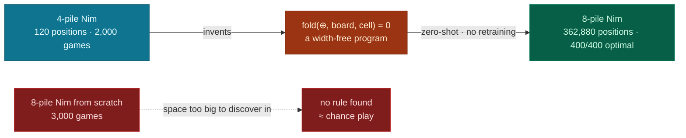
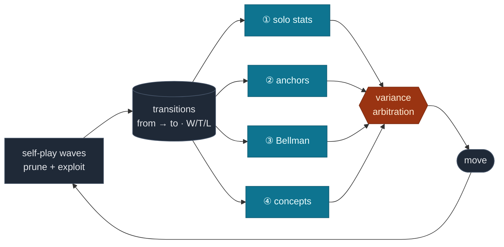
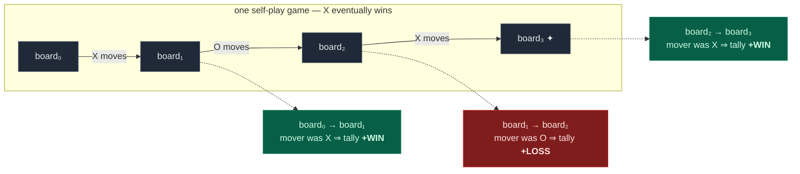
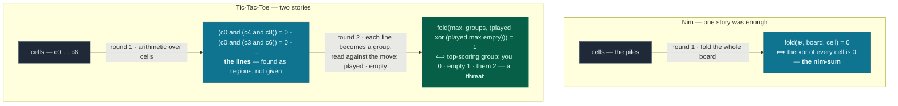
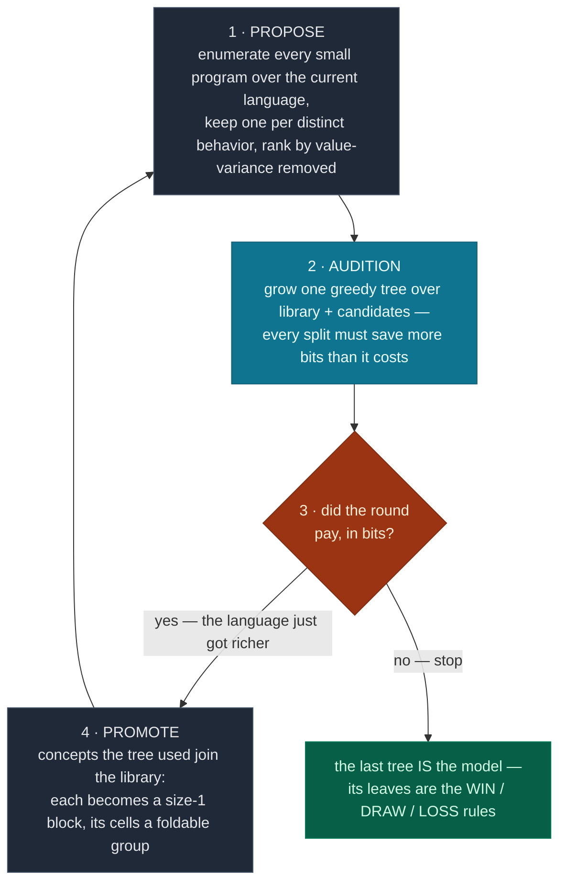
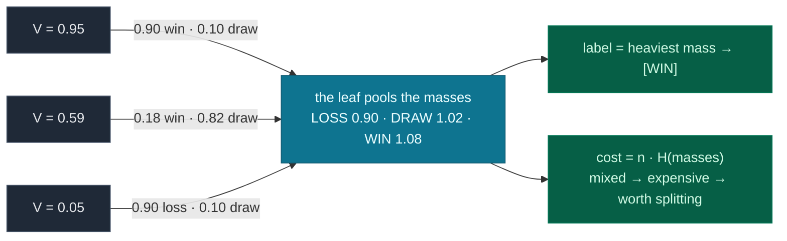
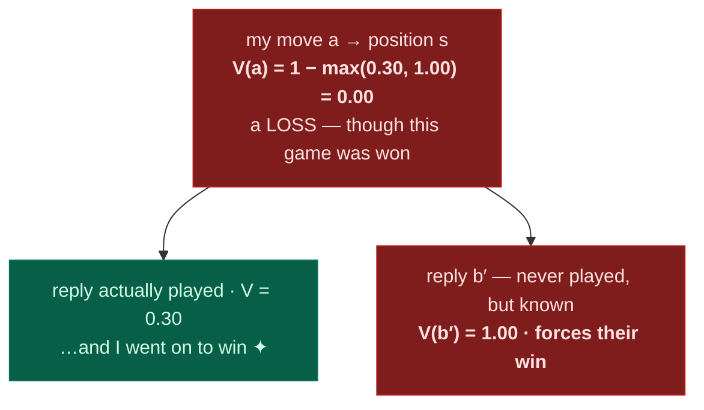

# Wise Explorer

**Zero-knowledge self-play that learns _human-readable rules_ and game-theoretic
values for any N-player game — no heuristics, no training data, no game-specific code.**

[](https://opensource.org/licenses/Apache-2.0)
&nbsp;·&nbsp; 📄 [Research paper](https://digitalcommons.oberlin.edu/honors/116/)
&nbsp;·&nbsp; 🌐 [mathewe.com](https://www.mathewe.com)

Given only a record of which moves led to wins, Wise Explorer builds four kinds of
knowledge — raw statistics, statistical clusters, minimax values, and **invented
concepts you can read** — and lets the *data itself* decide which to trust, move by move.

## It invents the theorem that solves Nim

Nim has been *solved* since 1901: you win by always moving so that the bitwise **XOR of the
pile sizes is zero** — the "nim-sum" (Bouton's theorem). **Wise Explorer was never told
this.** Given only a record of which moves won, it *invents* that formula during training —
as a program, built from nothing but cell reads, arithmetic, and one `fold` combinator —
and prints it when training ends:

```text
Discovered 1 concept, 2 rules:
  fold(⊕, board, cell) = 0      →  0.89     # xor of all piles is zero → you left a dead position
  ¬[fold(⊕, board, cell) = 0]   →  0.08     # otherwise → the opponent can punish you
```

Playing with that two-line model, it makes the optimal move in **every** winning
position of 4-pile Nim (96/96). See it derive the theorem yourself, in about a minute:

```bash
wise-explorer invent -g nim --fresh 10000
```

## …and the theorem transfers: discover small, play big

The invented rule is a width-free **program**, not a lookup table:

$$\text{fold}(\oplus,\ \text{board},\ \text{cell}) \;=\; \text{pile}_1 \oplus \text{pile}_2 \oplus \cdots \oplus \text{pile}_n \quad\text{for any } n$$

so knowledge learned on a small game applies to a big one unchanged. The library trained
only on 4-pile Nim (120 positions) plays **8-pile Nim** (362,880 positions, a state space
~3000× larger) **perfectly, zero-shot**:

| | trained on | plays 8-pile Nim | optimal moves |
|---|---|---|:--:|
| **zero-shot transfer** | 4-pile only (120 positions) | with no 8-pile data at all | **400/400** |
| from-scratch control | 8-pile, 3000 games | after seeing 1.65% of the space | 51/400 (≈ chance) |



The from-scratch agent can't find the rule in a space that big — but it never needed to be
found there. Discover where the game is small; apply where it is big. Run it yourself (~30 s):

```bash
python scripts/transfer_demo.py          # discover on n=4, play n=8 zero-shot
python scripts/transfer_demo.py --full   # + the honest controls (~4 min)
```

---

## How it works, in one picture

Every move is recorded as a **transition** — *this board → that board → who won* — and
from that one stream Wise Explorer grows four independent "views" of the game. For each
decision it trusts whichever view most *sharply separates* the moves on offer — the one
whose scores disagree the most (its **variance**).



The agent never knows *which* game it's playing — so different games simply light up
different views:

| In this game… | …the deciding view is | because |
|---|---|---|
| **Nim** | ③ Bellman (minimax) | value is purely game-theoretic |
| **Tic-Tac-Toe** | ② anchors (pooled stats of similar positions) | positions repeat and pool cleanly |
| **a position never seen before** | ④ invented concepts | only a formula generalizes from board *shape* |

---

## Quick start

```bash
git clone https://github.com/MatheweB/WiseExplorer
cd WiseExplorer
pip install -e .            # add ".[dev]" for the test suite
```

```bash
wise-explorer                              # play Tic-Tac-Toe vs the AI (default)
wise-explorer --game nim --epochs 2000     # train harder, on another game
wise-explorer --game minichess --self-play # watch the AI play itself
wise-explorer --no-training                # play from existing memory only
```

**See what it discovered** — `invent` shows the concepts and rules, with the full
bits-saved-vs-cost ledger of how each one earned its place. `--fresh N` trains a quick
throwaway demo first:

```bash
wise-explorer invent -g nim                  # concepts from your trained model
wise-explorer invent -g nim --fresh 10000    # ← train a demo, then watch it derive the nim-sum
python scripts/transfer_demo.py              # ← discover on 4 piles, play 8 zero-shot
```

<details>
<summary><b>All CLI options</b></summary>

| Flag | Short | Description |
|------|-------|-------------|
| `--game` | `-g` | `tic_tac_toe`, `minichess`, `nim` (default: `tic_tac_toe`) |
| `--epochs` | `-e` | Training epochs — scales the number of self-play simulations (default: 100) |
| `--turn-depth` | `-t` | Max turns per simulated game (default: 40) |
| `--workers` | `-w` | Parallel worker processes (default: CPU count − 1) |
| `--no-training` | | Play using existing memory only |
| `--self-play` | | AI plays for all players (no humans) |
| `--players` | `-p` | Comma-separated human player numbers, e.g. `1,2` (overrides `--self-play`) |
| `--markov` | | Use Markov (path-independent) states instead of transitions |
| `--gamma` | | Reverse n-ply credit decay, `1.0` = flat (default: `1.0`) |
| `--max-ply` | | Only credit this many plies back from the end (default: all) |

Training is **cumulative** — every run adds to the same database. Expect a few thousand
epochs before strong play emerges.
</details>

---

## The one idea: transitions

Most game AIs evaluate **positions** (*how good is this board?*). Wise Explorer evaluates
**transitions** (*this board → that board, and what became of the player who moved?*).
The outcome is always stored **from the mover's perspective** — and that single choice is
what makes everything else game- and player-count-agnostic. Watch one game decompose:



The *same game* feeds opposite tallies — each move is credited with **its own mover's**
eventual result, so nobody tracks whose turn it is, and the same `from → to` reached in
other games pools into one tally (`W=128 · T=14 · L=37 → 0.74`).

Because every player records *its own* moves tagged with *its own* result, the identical
loop runs for two players or seven. A new game only has to describe its boards and say who
won ([custom games ↓](#implementing-a-custom-game)) — the learner never knows it's playing
Nim versus chess, only that some moves tend to precede wins.

---

## Four signals, and which to trust

Each legal move is scored by up to four signals — same transition record, four different
questions:

| | Signal | Asks | Generalizes to unseen boards? |
|--|--|--|:--:|
| ① | **solo** | "What happened the last time I made this *exact* move?" | — |
| ② | **anchor** | "What usually happens in positions *like* this one?" | — |
| ③ | **Bellman** | "What's the *true game-theoretic* value of this?" | — |
| ④ | **concept** | "What does the *formula I invented* say this is worth?" | ✅ the only one |

**The deciding move** — variance arbitration — is what makes the agent tick. For each
signal it computes how much it actually disagrees about the `k` moves on offer,

$$\mathrm{Var}(s) \;=\; \tfrac{1}{k}\sum_{i=1}^{k}\bigl(s_i - \bar{s}\bigr)^2
\qquad\begin{aligned} s_i &= \text{signal } s\text{'s score for move } i\\ \bar{s} &= \text{the mean of those } k \text{ scores}\end{aligned}$$

and trusts the **most discriminating** one. A signal that scores every move alike has
variance ≈ 0 — useless for *this* decision, by construction.

| signal | move A | move B | move C | variance | rank |
|---|:--:|:--:|:--:|:--:|:--|
| ① solo | 0.55 | 0.52 | 0.58 | 0.0006 | 4th · nearly flat |
| ② anchor | 0.60 | 0.58 | 0.61 | 0.0002 | 3rd · nearly flat |
| ④ concept | 0.45 | 0.66 | 0.52 | 0.0078 | 2nd |
| **③ Bellman** | **0.00** | **1.00** | **0.50** | **0.1667** | **1st · sharp ✦** |

*Ranked by the sharpest signal, ties broken by the next ⇒ the agent plays **move B**.*

Here **Bellman** separates a forced loss (`0.00`) from a forced win (`1.00`), so it decides.
In a midgame position where Bellman is flat, the *same* mechanism switches to whichever
signal does separate — **the data decides; nothing is hard-coded.** (Competitive play
refines this to reliability-first: Bellman ranks primary and the rest break ties, since
raw-count noise would otherwise out-shout a correct value. Training explores by a different
rule, [below ↓](#self-play-training).)

<details>
<summary><b>Under the hood: how each signal is computed</b></summary>

- **① solo** — the raw win/tie/loss tally `(w, t, l)` for this transition, scored with a
  **Bayesian mean**:

  $$\text{score} = \frac{(w+1)\cdot 1 + (t+1)\cdot \tfrac12 + (l+1)\cdot 0}{w+t+l+3}$$

  Wins are worth 1, ties ½, losses 0; the three `+1`s are *pseudocounts* — one imaginary
  game of each outcome (hence the `+3` below) — so a move seen once sits near `0.5` instead
  of swinging on a lucky result ([`core/types.py`](src/wise_explorer/core/types.py)).
- **② anchor** — positions whose win/tie/loss distributions are *statistically
  indistinguishable* are clustered, and a thinly-seen position borrows its cluster's pooled
  stats:

  ```mermaid
  flowchart LR
      classDef p fill:#1f2937,stroke:#475569,color:#e5e7eb
      classDef k fill:#0e7490,stroke:#155e75,color:#ecfeff
      A["position A<br/>3 games · 67% wins"] --> K["anchor<br/>18 games · 61% wins"]
      B["position B<br/>5 games · 60% wins"] --> K
      C["position C<br/>10 games · 60% wins"] --> K
      class A,B,C p
      class K k
  ```

  "Indistinguishable" is a **Bayes factor** test
  ([`core/bayes.py`](src/wise_explorer/core/bayes.py)) — one shared win-rate vs. two
  separate ones — not a hand-tuned threshold.
- **③ Bellman** — minimax value over the transition graph ([details ↓](#game-theoretic-propagation-bellman--n-player)).
- **④ concept** — the value the invented rule tree assigns to the resulting board
  ([details ↓](#inventing-concepts-the-discovery-engine)). Because a concept is a program,
  it values boards training never visited — this is the signal behind the zero-shot result.
- **Scoring & tie-breaks** — each move becomes a *tuple* in rank order (e.g.
  `(bell, concept, anchor, solo)`), compared lexicographically. When a signal's evidence is
  *unanimous and significant* it sharpens from the Bayesian mean to the exact ratio
  (`is_decisive`); and as Bellman values converge their variance grows, so game-theoretic
  truth tends to win the ranking long-run — auto-correcting any rule trusted too early.
  ([`selection/__init__.py`](src/wise_explorer/selection/__init__.py))

</details>

---

## Inventing concepts (the discovery engine)

Most self-play agents end up as an opaque table of numbers. Wise Explorer additionally
**invents the concepts** that explain its experience — as readable programs, *while it
trains*.

The whole language is three primitives — cell reads, arithmetic/bitwise operators, and one
combinator, **`fold(op, domain, body)`**: reduce a formula over a region of the board.
Everything it has ever discovered is some nesting of that one shape, and each round builds
its concepts *out of* the previous round's. The same loop grows a different tower per game:



Nim stops at one story because the nim-sum already explains everything; Tic-Tac-Toe keeps
climbing because threats only become *expressible* once lines exist to fold over. The
height of the tower is decided by the data, not by a schedule.

**How concepts are made — a loop whose judge is a tree.** Not a decision tree *or* an
iterative search: an iterated loop in which each round's candidates audition inside one
greedy decision tree, and only what the tree actually uses survives:



The three stages, briefly — the full anatomy lives in
[docs/concept-invention.md](docs/concept-invention.md) (enumeration counts, the mask/split
data structures, a worked split, why one combinator is enough, the honest limits):

- **Propose** is enumeration, not guessing: every program up to a size budget is built
  smallest-first, the six whole-board folds always offered (`fold(⊕, board, cell)` exists
  *before* anything knows it matters), and two formulas that behave identically on the
  data count as one concept — on 3-pile Nim that collapses the formula space to ≈ 13,600
  distinct behaviors, all scored in one vectorized pass.
- **Audition**: on the data a program is a *column*, a threshold makes it a *mask*, and a
  tree node is just an array of row indices the mask partitions. The node goes to the mask
  saving the most bits:

  $$\text{gain}(c) \;=\; \text{bits}(\text{node}) \;-\; \text{bits}(\text{node} \cap c) \;-\; \text{bits}(\text{node} \setminus c),
  \qquad \text{bits}(\cdot) = n \cdot H(\text{outcome masses})$$

- **Promote**: what the tree used becomes a size-1 block, its cells a foldable group — a
  threat is cheap in round 2 only because round 1 already paid for the lines. A concept is
  kept iff its savings beat its formula cost (`|c| · log₂ 12` — the **MDL** test of
  Rissanen, DreamCoder, [Peano](https://arxiv.org/abs/2211.15864)); the loop stops the
  moment a round can't pay. Mini-chess at feasible scale gets **none** — declining is a
  feature.

**Where the `[WIN]` / `[DRAW]` / `[LOSS]` labels come from.** No thresholds: each board's
value splits its mass between the two **outcome anchors** it sits between — `{0, ½, 1}`,
the game's own utility scale. A leaf pools its boards' masses; the heaviest mass names the
leaf, and the entropy of the masses is the leaf's cost in bits:



A value sitting *on* an anchor is pure mass (V = 1.0 is all win); anything between is
honestly mixed. The label is for reading — play ranks moves by the leaf's *value*, never
the word. (Hard cuts at 0.40/0.60 used to do this job; benched head-to-head, the soft
masses matched every result with half the duplicate concepts and less junk, so the cuts
were deleted.)

**Discovery happens during training.** Each wave of self-play folds its new boards into a
live table; the library refits cheaply every wave and runs a full search only when the
table has doubled *and* the current concepts have stopped explaining the data — so a
sufficient library does zero work. When training ends, one considered pass over the
converged values produces the model that is persisted and printed. A library can also be
**seeded from another game's DB** (`ConceptLibrary.seed_from`) — that's the transfer demo:
programs carry over; their worth is re-fit locally.

<details>
<summary><b>Verified run — Nim, 2,000 self-play games</b></summary>

```text
$ wise-explorer invent -g nim --fresh 2000

══ CONCEPT INVENTION — NIM ══   (119 boards · baseline 146 bits to explain)

ROUND 1  ✓ pays — saved 70 bits  vs  12 cost   (1 concept invented)
        + fold(⊕, board, cell) = 0
          ⟺ the xor of every cell is 0
ROUND 2  ✗ stop — saved 0 bits  vs  0 cost   (nothing new pays for itself)

→ stopped after round 1;  1 concept(s) kept.

RULES it builds from the invented concepts:
   [WIN ] n=24    avg=0.89   fold(⊕, board, cell) = 0
   [LOSS] n=95    avg=0.08   ¬[fold(⊕, board, cell) = 0]

KEY — each fold above, in plain terms (derived from the program, not asserted):
   fold(⊕, board, cell) = 0
      ⟺ the xor of every cell is 0
```

Every fold is printed **side by side with a derived reading** (the `⟺` lines): the renderer
enumerates the program over its possible inputs and states what the threshold picks out —
derived from the program itself, never hand-labeled. The key also grounds each *group* in
the cells it was discovered on (groups are regions, not necessarily lines — whatever cell
arithmetic proved predictive). On Tic-Tac-Toe:

```text
groups = the board regions it discovered: (c0·c4·c8) (c2·c4·c6) (c0·c1·c2) …
fold(max, groups, (played xor (played max empty))) = 1
   ⟺ the top-scoring group: you 0 · empty 1 · them 2
```

— here the regions are the win-lines, so this reads: *some line holds two opponent pieces
and one empty cell — they are one move from completing it.*

The engine was never given the rules of Nim, yet it compresses its experience to the
two-line theorem — provably correct against the nim-sum it was never told about.
(Exact bit counts vary slightly per run.)

</details>

---

## Game-theoretic propagation (Bellman → N-player)

The Bellman signal runs value iteration over the transition graph. After each game the
played line is swept **backward**: to score the move `a` that lands in position `s`, take
the best reply available *from* `s` and flip it — *good for them is bad for me*:

$$V(a) \;=\; 1 - \max_{b \,\in\, \text{replies}(s)} V(b)
\qquad\begin{aligned} V(a) &= \text{the mover's value for } a\\ \text{replies}(s) &= \textit{every} \text{ known move out of } s \text{, not just the one played}\end{aligned}$$

Ranging over *every* known reply is how it sees through a lucky win — watch the values
flow up the tree:



Raw statistics would praise `a` for sitting on a winning line; minimax sees the opponent
*could* have punished it. The agent learns the move was lucky, not good.

For games that aren't strictly adversarial (more than two players, or non-zero-sum), Wise
Explorer also records every *other* player's outcome and computes an **alignment factor α**
that interpolates between adversarial and cooperative backups
([`transition_memory.py`](src/wise_explorer/memory/transition_memory.py)). With no
cross-player data it defaults to `α = 0` — exact zero-sum minimax — so the generalization
costs nothing in the classic case.

<details>
<summary><b>The α formula</b></summary>

`α = max(0, μ_cross + μ_mover − 1)`, where `μ_cross` is the average outcome observed by the
*other* players and `μ_mover` the mover's own empirical mean. α is positive only when mover
and observers tend to do well *together* (aligned incentives); the backup is then
`α·v_next + (1−α)·(1−v_next)`, blending cooperative and adversarial values.

</details>

---

## Self-play training

Wise Explorer learns by playing **itself** — no opponent, no dataset. Games run in
**synchronized waves** ([`simulation/runner.py`](src/wise_explorer/simulation/runner.py)):
play a wave in parallel → commit transitions + Bellman sweep → consolidate anchors → grow
the concept library → repeat — so every wave learns from fresh statistics, and discovery
happens *during* training, not after it.

### Why *"Wise"* Explorer

A naive learner only ever chases moves that look good; it never builds certainty about what
*loses*. Wise Explorer splits its budget and deliberately explores **both** extremes:

| Phase | Behavior | Purpose |
|-------|----------|---------|
| **Prune** | one player deliberately plays its *worst* moves | charts and confirms losing lines, so they're never wandered into |
| **Exploit** | all players play their *best* moves | reinforces and sharpens winning strategy |

Half the training budget goes to pruning — each player taking its turn as the one dragged
through its worst lines — and half to a shared exploit phase.

Within a phase, the move is a weighted draw — each candidate's weight is its uncertainty
times the side of the value still being pinned down:

$$w_{\text{exploit}} = \mathrm{se} \cdot v \qquad\qquad w_{\text{prune}} = \mathrm{se} \cdot (1 - v)$$

(`se` = the move's standard error — how unsure we still are; `v` = its score; the two
weights are mirror images summing to `se`.) Exploit leans to strong-but-unsettled moves,
prune to weak-but-unsettled ones, both skip moves already pinned down. No dials: sampling
a move shrinks its `se`, so attention drifts onward by itself.

Deliberately playing badly is the *wisdom*: the agent that has thoroughly charted how to
lose is the one that never stumbles into it.

---

## Why it converges — the certainty frontier

The raw counts (`solo`, `anchor`) are **noisy** — they measure average, mixed-quality play.
**Bellman** is game-theoretic truth, but only *where it has converged* — and it converges
from the game's **end backward**, since a position is only as reliable as everything
explored beneath it. So a *frontier of certainty* advances from the terminal states toward
the opening, and the middlegame clears last:

| games | opening | middlegame | endgame |
|---|---|---|---|
| 8k | ░ foggy | ░ → ▒ converging | █ sharp |
| 24k | ▒ converging | █ sharp | █ sharp |

Ahead of the frontier the agent leans on discrimination (trustworthy for obvious tactics,
noise for subtle ones); behind it, Bellman decides. Exploration — which deliberately plays
losing lines too — is what moves the frontier. Measured against perfect Tic-Tac-Toe play
(800 uniformly-sampled reachable positions vs. minimax):

| after | optimal play |
|---|--:|
| 3,000 games | 81.8% |
| 8,000 games | 93.1% |
| 24,000 games | **99.9%** |

The system is **exploration-limited, not decision-limited**: give it coverage and play
converges to optimal.

---

## Using it as a library

```python
from wise_explorer.api import start_simulations
from wise_explorer.memory import for_game, open_readonly
from wise_explorer.games import TicTacToe
from wise_explorer.utils.factory import create_agent_swarms

game = TicTacToe()
swarms = create_agent_swarms(players=[1, 2], agents_per_player=20)
memory = for_game(game)                       # data/memory/tic_tac_toe.db by default

start_simulations(
    agent_swarms=swarms, game=game,
    turn_depth=20, simulations=200,
    memory=memory, training_enabled=True,
)
print(memory.get_info())                      # {'anchors': ..., 'concepts': ..., 'transitions': ...}
print(memory.concept_library.summary())       # the rules it invented, spelled out
memory.close()

# Markov mode: only the resulting position matters, V(s)=f(s) — faster, but discards
# path context (e.g. castling rights).  →  for_game(game, markov=True)
# Read-only handle (parallel workers / inspection)  →  open_readonly("data/memory/tic_tac_toe.db")
```

`for_game()` returns a `TransitionMemory` (default) or `MarkovMemory`; `GameMemory` is the
abstract base they share.

---

## Implementing a custom game

Implement the `GameBase` interface and register the game — nothing else changes. The
learner only ever sees integer board arrays and outcomes.

```python
from wise_explorer.games import GameBase, GameState
from wise_explorer.agent.agent import State
import numpy as np

class MyGame(GameBase):
    def game_id(self) -> str: ...            # unique name (used for the DB filename)
    def num_players(self) -> int: ...
    def get_state(self) -> GameState: ...    # current board (int ndarray) + active player
    def set_state(self, state: GameState) -> None: ...
    def valid_moves(self) -> np.ndarray: ...
    def apply_move(self, move: np.ndarray) -> None: ...
    def is_over(self) -> bool: ...
    def get_result(self, player: int) -> State: ...   # WIN / LOSS / TIE / NEUTRAL
    def current_player(self) -> int: ...
    def deep_clone(self) -> "MyGame": ...
    def clone(self) -> "MyGame": ...
    def state_string(self) -> str: ...       # pretty-print for debugging
```

Then add it to `GAMES` and `INITIAL_STATES` in
[`utils/config.py`](src/wise_explorer/utils/config.py). See
[`games/nim.py`](src/wise_explorer/games/nim.py) (minimal) and
[`games/minichess.py`](src/wise_explorer/games/minichess.py) (full) for examples.

---

## Project structure

```
src/wise_explorer/
├── cli.py · api.py             # CLI (train·play·invent) + public API (start_simulations)
├── synthesis.py                # the discovery engine: fold programs, MDL, live growth
├── agent/agent.py              # Agent dataclass and State enum
├── core/                       # types.py (Bayesian scoring) · hashing.py · bayes.py (Bayes factor)
├── games/                      # game_base.py · tic_tac_toe.py · nim.py · minichess.py
│
├── memory/                     # ── the heart of the system ──
│   ├── game_memory.py          # shared base: recording, scoring, signal fusion
│   ├── transition_memory.py    # path-dependent memory + Bellman / N-player α
│   ├── markov_memory.py        # path-independent (state) memory
│   ├── anchor_manager.py       # Bayes-factor clustering
│   └── concept_library.py      # persisted invented concepts (the live value signal)
│
├── selection/                  # variance arbitration · training (explore) · inference (compete)
├── simulation/                 # runner.py (waves) · worker.py · training.py (prune/exploit)
└── utils/ · debug/

scripts/transfer_demo.py        # discover the nim-sum on 4 piles, play 8 piles zero-shot
docs/concept-invention.md       # the discovery engine, in depth
tests/                          # mirrors src/   ·   data/memory/  SQLite DBs (auto-created)
```

---

## Research contributions

Beyond the 2019 thesis it re-implements, the ideas a reviewer may find notable — all
zero-prior-knowledge and game-agnostic:

1. **Concept invention from zero-knowledge self-play** — a program-synthesis engine
   (cell reads, arithmetic, one `fold` combinator) that invents the features explaining
   its experience, MDL-gated and reusing its own discoveries to build higher ones
   (lines → threats). On Nim it independently re-derives **Bouton's 1901 theorem**.
2. **Cross-scale knowledge transfer** — invented concepts are width-free programs, so a
   rule discovered on a 120-position game plays a 362,880-position game perfectly with
   zero training on it. Discover where the game is small; apply where it is big.
3. **Invention as part of training** — the library grows during self-play (cheap refit
   every wave; a full search only when the data has outgrown the current concepts), and
   its value feeds move selection as a live signal — the only one that generalizes to
   never-visited boards.
4. **Variance-arbitrated multi-signal selection** — letting the data decide, per position,
   whether statistics, clustering, game value, or an invented concept should drive the choice.
5. **A principled N-player / non-zero-sum generalization of minimax** via an alignment
   factor learned from cross-player outcomes, recovering zero-sum minimax as a special case.

> Re-imagined and substantially extended from my Oberlin honors thesis. The anchors,
> concept invention, Bellman propagation, and distribution sampling are independent
> research since 2019.

---

## Testing, troubleshooting & citation

```bash
pytest                  # full suite   ·   pytest tests/test_synthesis.py  for the engine
```

- **Play feels weak?** Training is cumulative — keep running; strong play can take thousands of epochs.
- **Experiment** by tuning the outcome weights atop [`core/types.py`](src/wise_explorer/core/types.py).
- **Start over** by deleting the `.db` files in `data/memory/`.
- **`database is locked`?** Delete the matching `.db-shm` / `.db-wal` files.
- **Performance** is workload-dependent — simple games run many hundreds of self-play games/sec
  on one worker and scale with `--workers`; move selection for known positions is ~constant-time.

If you use Wise Explorer in research, please cite the thesis:

```bibtex
@misc{wise_explorer,
  author = {Brandon Mathewe Banda},
  title  = {{General Game Playing as a Bandit-Arms Problem: A Multiagent
            Monte-Carlo Solution Exploiting Nash Equilibria}},
  year   = {2019},
  note   = {Undergraduate honors thesis, Oberlin College},
  url    = {https://digitalcommons.oberlin.edu/honors/116/}
}
```

Licensed under **Apache 2.0** — see [LICENSE](LICENSE). Contributions welcome (fork, branch,
`pytest`, PR); for bugs and ideas, [open an issue](https://github.com/MatheweB/WiseExplorer/issues).

---

*Built with curiosity and a willingness to take the path less traveled by.*
