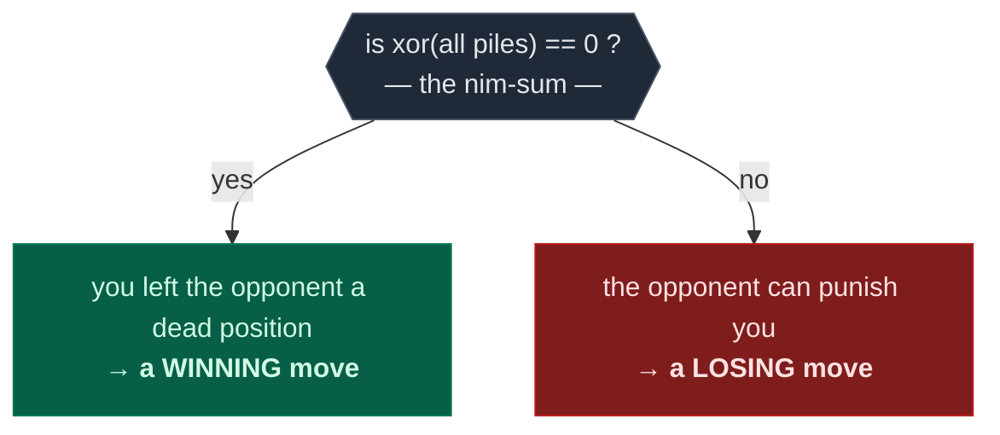
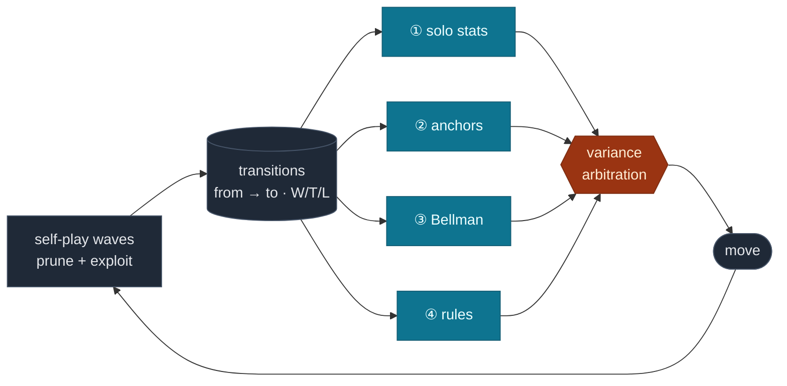
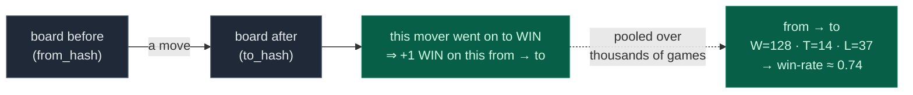
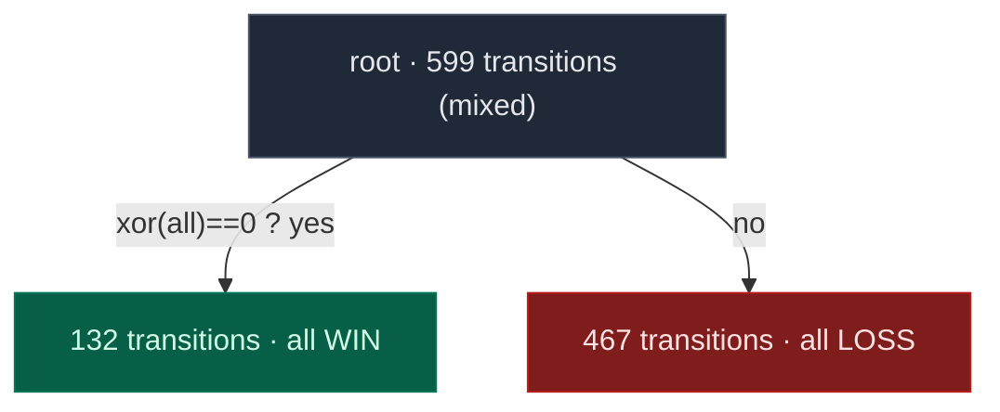
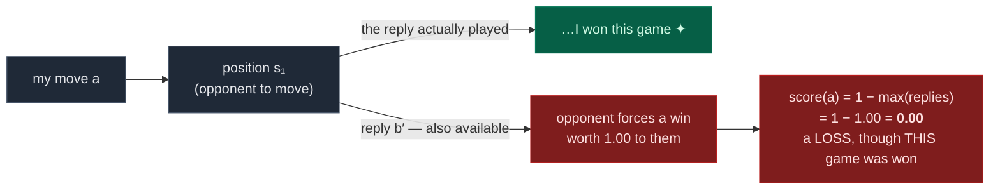
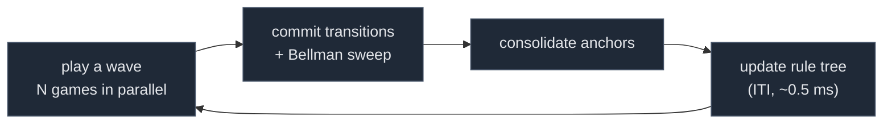
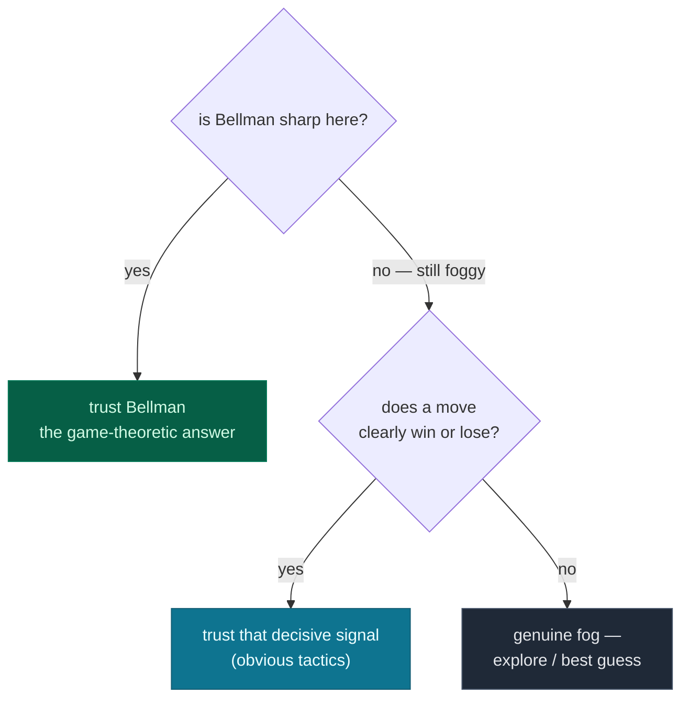

# Wise Explorer

**Zero-knowledge self-play that learns _human-readable rules_ and game-theoretic
values for any N-player game — no heuristics, no training data, no game-specific code.**

[](https://opensource.org/licenses/Apache-2.0)
&nbsp;·&nbsp; 📄 [Research paper](https://digitalcommons.oberlin.edu/honors/116/)
&nbsp;·&nbsp; 🌐 [mathewe.com](https://www.mathewe.com)

Given only a record of which moves led to wins, Wise Explorer builds four kinds of
knowledge — raw statistics, statistical clusters, minimax values, and **symbolic
rules you can read** — and lets the *data itself* decide which to trust, move by move.

## It self-discovers interpretable rules that solve games (like Nim)

Nim has been *solved* since 1901: you win by always moving so that the bitwise **XOR of the
pile sizes is zero** — the "nim-sum" (Bouton's theorem). **Wise Explorer was never told
this.** Given only a record of which moves won, after playing itself it grew a decision tree
whose very first question about *any* position is exactly that test:



Every rule it writes refines this one question, and **on Nim every one is provably correct**
against the theorem the agent had no knowledge of. See for yourself:

```bash
wise-explorer inspect -g nim --fresh 10000
```

---

## How it works, in one picture

Every move is recorded as a **transition** — *this board → that board → who won* — and
from that one stream Wise Explorer grows four independent "views" of the game. For each
decision it trusts whichever view most *sharply separates* the moves on offer — the one
whose scores disagree the most (its **variance**).



The agent never knows *which* game it's playing — so different games simply light up
different views:

| In this game… | …the deciding view is | because |
|---|---|---|
| **Nim** | ③ Bellman (minimax) | value is purely game-theoretic |
| **Tic-Tac-Toe** | ② anchors (pooled stats of similar positions) | positions repeat and pool cleanly |
| **a position never seen before** | ④ mined rules | only rules generalize from board *shape* |

---

## Quick start

```bash
git clone https://github.com/MatheweB/WiseExplorer
cd WiseExplorer
pip install -e .            # add ".[dev]" for the test suite
```

```bash
wise-explorer                              # play Tic-Tac-Toe vs the AI (default)
wise-explorer --game nim --epochs 2000     # train harder, on another game
wise-explorer --game minichess --self-play # watch the AI play itself
wise-explorer --no-training                # play from existing memory only
```

**See what it learned** — `inspect` reads the rules a game has already learned (no
retraining), each with a board diagram, plain-language statement, and (for games with known
theory) a *provably-correct* verdict. `--fresh N` trains a quick throwaway demo first:

```bash
wise-explorer inspect -g nim                 # rules from your trained model
wise-explorer inspect -g nim --fresh 10000   # ← train a demo, then watch it derive the nim-sum
```

> The standalone `python scripts/inspect_predicates.py nim 10000` still works — it's a thin
> wrapper around the same command.

<details>
<summary><b>All CLI options</b></summary>

| Flag | Short | Description |
|------|-------|-------------|
| `--game` | `-g` | `tic_tac_toe`, `minichess`, `nim` (default: `tic_tac_toe`) |
| `--epochs` | `-e` | Training epochs — scales the number of self-play simulations (default: 100) |
| `--turn-depth` | `-t` | Max turns per simulated game (default: 40) |
| `--workers` | `-w` | Parallel worker processes (default: CPU count − 1) |
| `--no-training` | | Play using existing memory only |
| `--self-play` | | AI plays for all players (no humans) |
| `--players` | `-p` | Comma-separated human player numbers, e.g. `1,2` (overrides `--self-play`) |
| `--markov` | | Use Markov (path-independent) states instead of transitions |
| `--gamma` | | Reverse n-ply credit decay, `1.0` = flat (default: `1.0`) |
| `--max-ply` | | Only credit this many plies back from the end (default: all) |

Training is **cumulative** — every run adds to the same database. Expect a few thousand
epochs before strong play emerges.
</details>

---

## The one idea: transitions

Most game AIs evaluate **positions** (*how good is this board?*). Wise Explorer evaluates
**transitions** (*this board → that board, and what became of the player who moved?*).
The outcome is always stored **from the mover's perspective** — and that single choice is
what makes everything else game- and player-count-agnostic.



| What it buys | Why |
|---|---|
| **No turn bookkeeping** | "A win is a win for whoever moved" — boards are just hashed integer arrays |
| **Any number of players, any order** | each player records *its own* moves tagged with *its own* result; nothing counts players |
| **Evidence compounds** | the same `from → to` reached by different move orders pools into one tally |

So a new game only has to describe its boards and say who won
([custom games ↓](#implementing-a-custom-game)). The learner never knows it's playing Nim
versus chess — only that some moves tend to precede wins.

---

## Four signals, and which to trust

Each legal move is scored by up to four signals — same transition record, four different
questions:

| | Signal | Asks | Generalizes to unseen boards? |
|--|--|--|:--:|
| ① | **solo** | "What happened the last time I made this *exact* move?" | — |
| ② | **anchor** | "What usually happens in positions *like* this one?" | — |
| ③ | **Bellman** | "What's the *true game-theoretic* value of this?" | — |
| ④ | **rules** | "Does this position match a *pattern* I've mined?" | ✅ the only one |

**The deciding move** — variance arbitration — is what makes the agent tick. For each
signal it asks *"how much do you actually disagree about these moves?"* (their variance
across the moves on offer) and trusts the **most discriminating** one. A signal that
scores every move alike is, by construction, useless for *this* decision.

| signal | move A | move B | move C | variance | rank |
|---|:--:|:--:|:--:|:--:|:--|
| ① solo | 0.55 | 0.52 | 0.58 | 0.0006 | 4th · nearly flat |
| ② anchor | 0.60 | 0.58 | 0.61 | 0.0002 | 3rd · nearly flat |
| ④ rules | 0.45 | 0.66 | 0.52 | 0.0078 | 2nd |
| **③ Bellman** | **0.00** | **1.00** | **0.50** | **0.1667** | **1st · sharp ✦** |

*Ranked by the sharpest signal, ties broken by the next ⇒ the agent plays **move B**.*

Here **Bellman** sharply separates the moves — one a forced loss (`0.00`), one a forced win
(`1.00`) — so it decides, and the flat statistical signals are (correctly) ignored. In a
midgame Tic-Tac-Toe position the Bellman values might all be flat while clustered
statistics do the separating — and the *same* mechanism quietly switches to trusting
**anchor**. **The data decides; nothing is hard-coded.**

This variance ranking drives *exploration* (training), where spreading the moves apart is
what you want. For *competitive play* it's refined to **reliability-first** — rank the
de-noised Bellman value primary, the rest as tiebreakers — because raw-count noise inflates
discrimination and would otherwise override a correct Bellman value. ([Why it converges ↓](#why-it-converges--the-certainty-frontier) makes this concrete: +3.4% optimal play on Tic-Tac-Toe.)

<details>
<summary><b>Under the hood: how each signal is computed</b></summary>

- **① solo** — the raw win/tie/loss tally for this transition, scored with a **Bayesian
  mean** (`α = 1` pseudocounts) so a move seen once or twice sits near `0.5` instead of
  swinging on a lucky result ([`core/types.py`](src/wise_explorer/core/types.py)).
- **② anchor** — positions whose win/tie/loss distributions are *statistically
  indistinguishable* are clustered, and a thinly-seen position borrows its cluster's pooled
  stats:

  ```mermaid
  flowchart LR
      classDef p fill:#1f2937,stroke:#475569,color:#e5e7eb
      classDef k fill:#0e7490,stroke:#155e75,color:#ecfeff
      A["position A<br/>3 games · 67% wins"] --> K["anchor<br/>18 games · 61% wins"]
      B["position B<br/>5 games · 60% wins"] --> K
      C["position C<br/>10 games · 60% wins"] --> K
      class A,B,C p
      class K k
  ```

  "Indistinguishable" is a **Bayes factor** test
  ([`core/bayes.py`](src/wise_explorer/core/bayes.py)) — one shared win-rate vs. two
  separate ones — not a hand-tuned threshold.
- **③ Bellman** — minimax value over the transition graph ([details ↓](#game-theoretic-propagation-bellman--n-player)).
- **④ rules** — a structural prior from the predicate library ([details ↓](#learning-readable-rules-predicate-mining)).
- **Scoring & tie-breaks** — each move becomes a *tuple* in rank order (e.g.
  `(bell, pred, anchor, solo)`), compared lexicographically. When a signal's evidence is
  *unanimous and significant* it sharpens from the Bayesian mean to the exact ratio
  (`is_decisive`); and as Bellman values converge their variance grows, so game-theoretic
  truth tends to win the ranking long-run — auto-correcting any rule trusted too early.
  ([`selection/__init__.py`](src/wise_explorer/selection/__init__.py))

</details>

---

## Learning readable rules (predicate mining)

Most self-play agents end up as an opaque table of numbers. Wise Explorer additionally
distills its experience into a few **symbolic rules you can read**:

```
Rule: nim-sum = 0  AND  no pile exceeds 1   →  WIN   (you left the opponent a dead position)
Rule: nim-sum ≠ 0                           →  LOSS  (the opponent can force a win)
```

Rules are built from a small typed language
([`memory/predicates.py`](src/wise_explorer/memory/predicates.py)) — board reads, boolean
**atoms** (`==`, `>`, and aggregates like `sum`/`count`/**`xor`** over rows, columns, and
the whole board), and the logical connectives `∃ · ∧ · ¬ · ∨` — rich enough that the
`xor`-of-all-heaps atom *is* the nim-sum that defines optimal Nim.

**How a rule is found.** Mining is a regression decision tree (CART) over the transitions.
Each transition `i` carries a value `v_i ∈ [0,1]` (≈1 if the move tends to win, ≈0 if it
loses), a support `n_i` (games routed through it), and a Bayesian standard error `se_i` from
its win/tie/loss counts — so its sampling variance is `se_i²`. The whole thing is one idea:
**observed variance = structural + sampling**, and we keep splitting while the structural
part is positive.

**De-noised target.** Raw win-rates are noisy — the [`prune` phase](#why-wise-explorer)
deliberately plays losing moves, logging losses on strong positions. So `v_i` is the minimax
(Bellman) value, the same
outcomes with that exploration noise backed out by the backup, *when it has converged*;
otherwise the raw win-rate. The choice is global (one signal for the whole tree) and
automatic: use Bellman iff its variance clears the noise floor, `Var(bell) > σ̄²`. On large
games the backup never converges — it sticks near its 0.5 prior (`Var ≈ 0`) and is dropped.

**Noise floor.** Across a node, the floor is the support-weighted mean per-sample variance,
so a transition seen once (huge `se_i²`) can't inflate it:

> `σ̄² = ( Σ_i n_i · se_i² ) / ( Σ_i n_i )`

**Stop rule (variance decomposition).** Write `v_i = μ_i + ε_i` with true value `μ_i` and
sampling noise `Var(ε_i) = se_i²`. Then `Var(v) ≈ Var(μ) + σ̄²`, so the structural variance is
`Var(μ) ≈ Var(v) − σ̄²`, and a node becomes a leaf once it hits zero:

> `Var(v) ≤ σ̄²`   → no structure left to explain.

Parameter-free and self-scaling. Crucially `Var(v)` — the impurity used for both the stop and
the split gain — is **unweighted**: every transition counts equally, so one sharp, rare
winning move is never buried under the well-trodden lines. Support `n_i` enters *only* `σ̄²`.

**Split gain.** Split on the board predicate maximizing the unweighted variance reduction
`Δ = Var(parent) − [ (n_L/n)·Var(left) + (n_R/n)·Var(right) ]`; stop if even the best `Δ ≤ 0`.

On Nim this collapses to the theorem — one split on the nim-sum, two pure leaves:



Richer games give more, value-graded rules (Tic-Tac-Toe ~20–30); games too large to sample
decisively (mini-chess, `minichess`, at feasible scale) leave `Var(μ) ≈ 0` everywhere and
**abstain** rather than invent rules from noise — declining is a feature.

<details>
<summary><b>The two miners</b></summary>

Two miners share the atom machinery
([`tree_miner.py`](src/wise_explorer/memory/tree_miner.py),
[`iti_miner.py`](src/wise_explorer/memory/iti_miner.py)):

- **Batch CART** — deterministic and globally optimal at each split. Builds the saved rule
  set (end of training) and powers inspection. Atom generation and the match matrix are
  tensor-accelerated (CPU or GPU via PyTorch).
- **Incremental Tree Inducer (ITI)** — [Utgoff (1997)](https://doi.org/10.1023/A:1007413323501)
  — keeps a tree updated as transitions stream in (~0.5 ms/wave) so its structure can *spur*
  exploration during training. It trades the batch miner's optimality for that speed, so the
  deployed rules are always rebuilt with batch CART.

</details>

<details>
<summary><b>Verified run — Nim, 10,000 self-play games</b></summary>

```text
$ wise-explorer inspect -g nim --fresh 10000

  ┌──────────────────────── SUMMARY ────────────────────────┐
  │ Total predicates:    2                                   │
  │ Provably correct:    2   ← both match the true nim-sum   │
  └──────────────────────────────────────────────────────────┘

  Rule: nim-sum = 0   →  WIN   (n=132, all matching positions are forced wins)
  Rule: nim-sum ≠ 0   →  LOSS  (n=467, all matching positions are forced losses)
```

The miner was never given the rules of Nim, yet it distils its experience to the two-line
theorem — provably correct against the nim-sum. (Counts vary slightly per run; a re-mine may
add a few refinements under the WIN branch.)

</details>

---

## Game-theoretic propagation (Bellman → N-player)

The Bellman signal runs value iteration over the transition graph. After each game the
played line is swept **backward**: to score the move that *lands* in a position, the agent
takes the **best reply available from there** and flips it — *good for them is bad for me*,
`score = 1 − max(replies)`. Crucially, "best reply" ranges over *every* known reply, not
just the one played — which is how it sees through a lucky win:



Raw statistics would praise move `a` for sitting on a winning line; minimax sees it walked
into a position the opponent *could* have punished. The agent learns the move was lucky,
not good.

For games that aren't strictly adversarial (more than two players, or non-zero-sum), Wise
Explorer also records every *other* player's outcome and computes an **alignment factor α**
that interpolates between adversarial and cooperative backups
([`transition_memory.py`](src/wise_explorer/memory/transition_memory.py)). With no
cross-player data it defaults to `α = 0` — exact zero-sum minimax — so the generalization
costs nothing in the classic case.

<details>
<summary><b>The α formula</b></summary>

`α = max(0, μ_cross + μ_mover − 1)`, where `μ_cross` is the average outcome observed by the
*other* players and `μ_mover` the mover's own empirical mean. α is positive only when mover
and observers tend to do well *together* (aligned incentives); the backup is then
`α·v_next + (1−α)·(1−v_next)`, blending cooperative and adversarial values.

</details>

---

## Self-play training

Wise Explorer learns by playing **itself** — no opponent, no dataset. A single game runs
move by move ([`simulation/worker.py`](src/wise_explorer/simulation/worker.py)): the player
on turn picks a move (probabilistically, to keep exploring), the move is applied, and
`(move, board_before, player)` is appended to *that player's own* trajectory. At the end,
each player's trajectory is recorded tagged with its own result — so the identical loop
runs for two players or seven.

Games run in **synchronized waves** so knowledge compounds instead of drifting on stale
stats ([`simulation/runner.py`](src/wise_explorer/simulation/runner.py)):



### Why *"Wise"* Explorer

A naive learner only ever chases moves that look good; it never builds certainty about what
*loses*. Wise Explorer splits its budget and deliberately explores **both** extremes:

| Phase | Behavior | Purpose |
|-------|----------|---------|
| **Prune** | one player deliberately plays its *worst* moves | charts and confirms losing lines, so they're never wandered into |
| **Exploit** | all players play their *best* moves | reinforces and sharpens winning strategy |

Half the training budget goes to pruning — each player taking its turn as the one dragged
through its worst lines — and half to a shared exploit phase.

Deliberately playing badly is the *wisdom*: the agent that has thoroughly charted how to
lose is the one that never stumbles into it — the same dual-curiosity as the decision tree
keeping both branches, and the Bellman sweep distrusting a lucky win.

---

## Why it converges — the certainty frontier

Three forces are in tension. The raw win/loss counts (`solo`, `anchor`) are **noisy** —
they measure *average, mixed-quality play* (half the budget is the prune phase's deliberately
weak moves), not best-play value, and most positions are barely seen. **Bellman** is the clean
game-theoretic truth — *best play assumed* — but only *where it has converged*. And **exploration** is what
makes Bellman converge. Here's how they resolve into optimal play.

**Bellman is exact at the game's end, and its certainty spreads backward.** A position is
only as reliable as everything explored beneath it, so a *frontier of certainty* advances
from the terminal states toward the opening as coverage fills in. The middlegame clears
**last** — it's furthest from the end:

```
   opening ────────────────── middlegame ─────────────── end ✦
   8k    ░░░░░░░░░░░░░░░░░░░░░░░░░░░░░░░░░░░▒▒▒▒▒██████
   32k   ░░░░░▒▒▒▒▒▒▒▒▒▒▒▒▒▒▒▒▒▒▒▒▒▒▒▒▒▒▒▒▒██████████████
         ░ foggy → discrimination    ▒ converging    █ Bellman sharp
```

Left of the frontier Bellman is foggy, so the agent leans on **discrimination** — which is
trustworthy only for the *obviously* decisive moves (an immediate win or loss) and noise
for the subtle ones. So each move is decided by reliability first, discrimination next, a
guess last:



And the loop closes: exploration (which deliberately plays losing lines too) shrinks the
fog → Bellman converges → competitive play trusts it first. Measured against perfect
Tic-Tac-Toe, optimal play marches up exactly as coverage completes:

| after | move coverage | Bellman error | optimal play |
|---|--:|--:|--:|
| 8,000 games | 82% | 0.26 | 88% |
| 32,000 games | 99% | 0.14 | **99.6%** |

So the system is **exploration-limited, not decision-limited**: give it enough coverage and
play converges to optimal, the middlegame fog burning off last.

---

## Using it as a library

```python
from wise_explorer.api import start_simulations
from wise_explorer.memory import for_game, open_readonly
from wise_explorer.games import TicTacToe
from wise_explorer.utils.factory import create_agent_swarms

game = TicTacToe()
swarms = create_agent_swarms(players=[1, 2], agents_per_player=20)
memory = for_game(game)                       # data/memory/tic_tac_toe.db by default

start_simulations(
    agent_swarms=swarms, game=game,
    turn_depth=20, simulations=200,
    memory=memory, training_enabled=True,
)
print(memory.get_info())                      # {'anchors': ..., 'predicates': ..., 'transitions': ...}
memory.close()

# Markov mode: only the resulting position matters, V(s)=f(s) — faster, but discards
# path context (e.g. castling rights).  →  for_game(game, markov=True)
# Read-only handle (parallel workers / inspection)  →  open_readonly("data/memory/tic_tac_toe.db")
```

`for_game()` returns a `TransitionMemory` (default) or `MarkovMemory`; `GameMemory` is the
abstract base they share.

---

## Implementing a custom game

Implement the `GameBase` interface and register the game — nothing else changes. The
learner only ever sees integer board arrays and outcomes.

```python
from wise_explorer.games import GameBase, GameState
from wise_explorer.agent.agent import State
import numpy as np

class MyGame(GameBase):
    def game_id(self) -> str: ...            # unique name (used for the DB filename)
    def num_players(self) -> int: ...
    def get_state(self) -> GameState: ...    # current board (int ndarray) + active player
    def set_state(self, state: GameState) -> None: ...
    def valid_moves(self) -> np.ndarray: ...
    def apply_move(self, move: np.ndarray) -> None: ...
    def is_over(self) -> bool: ...
    def get_result(self, player: int) -> State: ...   # WIN / LOSS / TIE / NEUTRAL
    def current_player(self) -> int: ...
    def deep_clone(self) -> "MyGame": ...
    def clone(self) -> "MyGame": ...
    def state_string(self) -> str: ...       # pretty-print for debugging
```

Then add it to `GAMES` and `INITIAL_STATES` in
[`utils/config.py`](src/wise_explorer/utils/config.py). See
[`games/nim.py`](src/wise_explorer/games/nim.py) (minimal) and
[`games/minichess.py`](src/wise_explorer/games/minichess.py) (full) for examples.

---

## Project structure

```
src/wise_explorer/
├── cli.py · api.py             # CLI (train·play·inspect) + public API (start_simulations)
├── inspection.py               # renders learned rules (shared by CLI + script)
├── agent/agent.py              # Agent dataclass and State enum
├── core/                       # types.py (Bayesian scoring) · hashing.py · bayes.py (Bayes factor)
├── games/                      # game_base.py · tic_tac_toe.py · nim.py · minichess.py
│
├── memory/                     # ── the heart of the system ──
│   ├── game_memory.py          # shared base: recording, scoring, signal fusion
│   ├── transition_memory.py    # path-dependent memory + Bellman / N-player α
│   ├── markov_memory.py        # path-independent (state) memory
│   ├── anchor_manager.py       # Bayes-factor clustering
│   ├── predicates.py           # expression language + predicate library
│   ├── tree_miner.py           # batch CART rule miner (tensor-accelerated)
│   └── iti_miner.py            # Incremental Tree Inducer (Utgoff 1997)
│
├── selection/                  # variance arbitration · training (explore) · inference (compete)
├── simulation/                 # runner.py (waves) · worker.py · training.py (prune/exploit)
└── utils/ · debug/ · scripts/

scripts/inspect_predicates.py   # thin wrapper — prefer `wise-explorer inspect`
tests/                          # mirrors src/   ·   data/memory/  SQLite DBs (auto-created)
```

---

## Research contributions

Beyond the 2019 thesis it re-implements, the ideas a reviewer may find notable — all
zero-prior-knowledge and game-agnostic:

1. **Interpretable rule induction from zero-knowledge self-play** — a typed predicate
   language + CART/ITI miner that distills play into human-readable rules. On Nim it
   independently recovers **Bouton's 1901 theorem** (the nim-sum) as the root of its
   decision tree, every rule provably correct against a theory it was never given.
2. **Parameter-free, de-noised rule mining** — the tree fits the minimax-de-noised value and
   stops by a variance-decomposition test (`Var(v) ≤ σ̄²`), discovering structure with no tuned
   thresholds and *abstaining* rather than overfitting noise when a game is too sparsely sampled.
3. **Variance-arbitrated multi-signal selection** — letting the data decide, per position,
   whether statistics, clustering, game value, or a learned rule should drive the choice.
4. **A principled N-player / non-zero-sum generalization of minimax** via an alignment
   factor learned from cross-player outcomes, recovering zero-sum minimax as a special case.

> Re-imagined and substantially extended from my Oberlin honors thesis. The anchors,
> predicate mining, Bellman propagation, and distribution sampling are independent research
> since 2019.

---

## Testing, troubleshooting & citation

```bash
pytest                  # full suite   ·   pytest tests/memory/  for the mining tests
```

- **Play feels weak?** Training is cumulative — keep running; strong play can take thousands of epochs.
- **Experiment** by tuning the outcome weights atop [`core/types.py`](src/wise_explorer/core/types.py).
- **Start over** by deleting the `.db` files in `data/memory/`.
- **`database is locked`?** Delete the matching `.db-shm` / `.db-wal` files.
- **Performance** is workload-dependent — simple games run many hundreds of self-play games/sec
  on one worker and scale with `--workers`; move selection for known positions is ~constant-time.

If you use Wise Explorer in research, please cite the thesis:

```bibtex
@misc{wise_explorer,
  author = {Brandon Mathewe Banda},
  title  = {{General Game Playing as a Bandit-Arms Problem: A Multiagent
            Monte-Carlo Solution Exploiting Nash Equilibria}},
  year   = {2019},
  note   = {Undergraduate honors thesis, Oberlin College},
  url    = {https://digitalcommons.oberlin.edu/honors/116/}
}
```

Licensed under **Apache 2.0** — see [LICENSE](LICENSE). Contributions welcome (fork, branch,
`pytest`, PR); for bugs and ideas, [open an issue](https://github.com/MatheweB/WiseExplorer/issues).

---

*Built with curiosity and a willingness to take the path less traveled by.*
