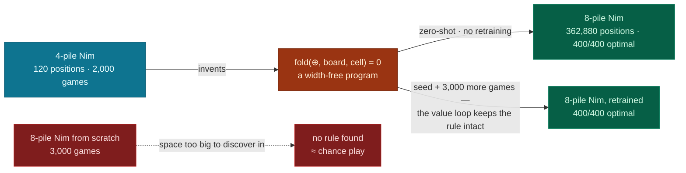
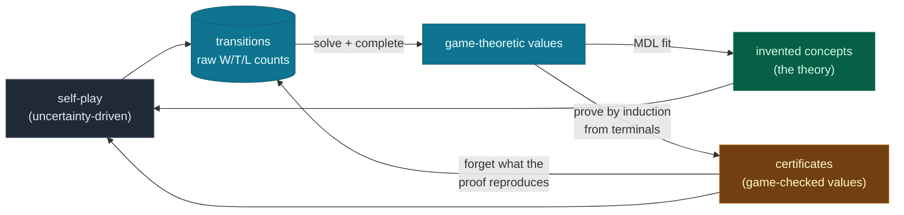
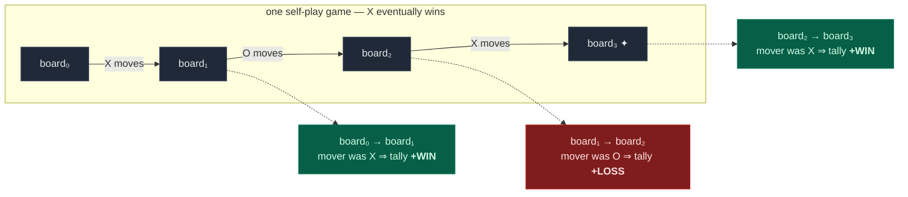
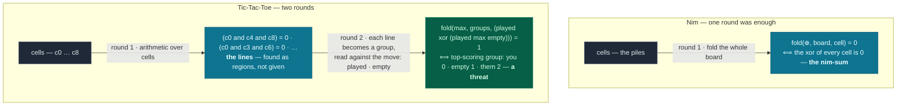
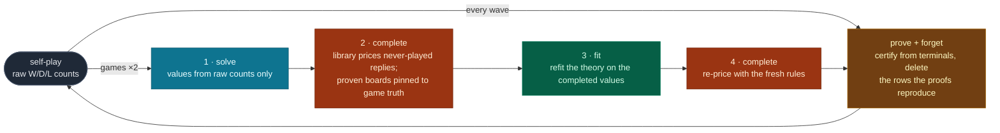
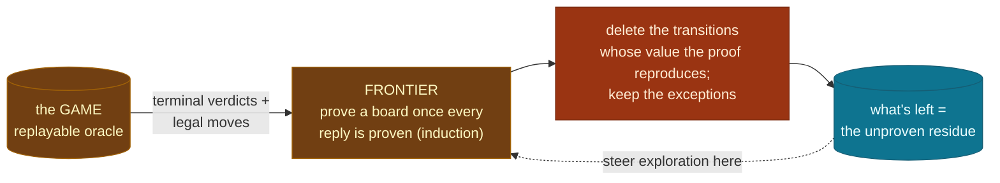

# Wise Explorer

**Zero-knowledge self-play that learns _human-readable rules_ and game-theoretic
values for any N-player game — then proves what it can and forgets the games it no
longer needs. No heuristics, no training data, no game-specific code.**

[](https://opensource.org/licenses/Apache-2.0)
&nbsp;·&nbsp; 📄 [Research paper](https://digitalcommons.oberlin.edu/honors/116/)
&nbsp;·&nbsp; 🌐 [mathewe.com](https://www.mathewe.com)

Given only a record of which moves led to wins, Wise Explorer builds a **readable theory** of the
game — invented concepts plus game-theoretic values — and lets the *data itself* decide which to
trust, move by move. Where the game can prove a value, it stores the proof and forgets the games
that proof makes redundant. The Nim example below is the whole idea in one game.

## It invents the theorem that solves Nim — then proves it and forgets

Nim has been *solved* since 1901: you win by always moving so the bitwise **XOR of the
pile sizes is zero** — the "nim-sum" (Bouton's theorem). **Wise Explorer was never told
this.** From a record of which moves won, it *invents* that formula during training — a
program built from nothing but cell reads, arithmetic, and one `fold` combinator:

```text
Discovered 1 concept, 2 rules:
  K₁ = 0   ⟺ the xor of every cell is 0
  ├─ yes → [WIN ] n=24   avg=1.00      # you left a dead position
  └─ no  → [LOSS] n=95   avg=0.00      # the opponent can punish you

  K₁ = fold(⊕, board, cell)
```

Then it goes further. The game itself is a **replayable oracle**, so the system *proves*
each board's value by induction from the terminal positions — no play, nothing the
theory can bias — and **deletes every stored game the proof reproduces**. On 4-pile Nim
the transition table collapses **594 rows → 0** while play stays optimal in **every**
winning position (96/96) — and once the opening itself is proven, **training halts on its
own** (~400 games, not the 2,000 you asked for: the game is solved, there is nothing left to
learn). The two-line theorem is the only thing left. Watch it, in seconds:

```bash
wise-explorer train -g nim --games 2000   # discovers the nim-sum, proves it, empties the table, stops when solved
wise-explorer invent -g nim               # prints the two-line theorem it plays with
```

## …and the theorem transfers: discover small, play big

The invented rule is a width-free **program**, not a lookup table:

$$\text{fold}(\oplus,\ \text{board},\ \text{cell}) \;=\; \text{pile}_1 \oplus \text{pile}_2 \oplus \cdots \oplus \text{pile}_n \quad\text{for any } n$$

so knowledge learned on a small game applies to a big one unchanged. The library trained
only on 4-pile Nim (120 positions) plays **8-pile Nim** (362,880 positions, a state space
~3000× larger) **perfectly, zero-shot**:

| | trained on | plays 8-pile Nim | optimal moves |
|---|---|---|:--:|
| **zero-shot transfer** | 4-pile only (120 positions) | with no 8-pile data at all | **400/400** |
| from-scratch control | 8-pile, 3000 games | after seeing ~7% of the space | 51/400 (≈ chance) |
| **seeded, then retrained** | 4-pile seed + 3000 8-pile games | the [value loop](docs/value-loop.md) keeps the rule intact | **400/400** |



The from-scratch agent can't find the rule in a space that big — but it never needed to be
found there. Discover where the game is small; apply where it is big. Run it yourself (~30 s):

```bash
wise-explorer transfer                    # discover on 4 piles, play 8 zero-shot (~30 s)
wise-explorer transfer --piles 10 --full  # bigger target, plus the honest controls
```

---

## How it works, in one picture

Every move is recorded as a **transition** — *this board → that board → who won*. From
that one stream the system computes game-theoretic values, **invents concepts** that
explain them, **proves** the values the game can confirm, and **forgets** the rows those
proofs make redundant. What remains stored is exactly what the theory cannot yet account
for — the map of where to look next.



At move time the system ranks each option by a single **evidence ladder** — strongest
form of evidence first — so there is no signal to arbitrate and nothing to tune:

| rung | evidence | available |
|---|---|---|
| ① **proven** | the game's own verdict for the board (a certificate) | last — spreads from the endgame |
| ② **concept** | the invented theory's value for the board | once a theory forms |
| ③ **statistics** | the raw win/tie/loss counts | immediately, everywhere |

A move with a proven win outranks any unproven move; among unproven moves the theory
decides; where the theory is silent, the statistics do. Each rung is a cleaner estimate
of the same quantity, `V(board)`, and the higher rungs retire the lower ones region by
region as the game is understood.

---

## The one idea: transitions are a cache

Most game AIs evaluate **positions** (*how good is this board?*). Wise Explorer evaluates
**transitions** (*this board → that board, and what became of the player who moved?*).
The outcome is always stored **from the mover's perspective** — and that single choice is
what makes everything game- and player-count-agnostic. Watch one game decompose:



The *same game* feeds opposite tallies — each move is credited with **its own mover's**
eventual result, so nobody tracks whose turn it is, and the same `from → to` reached in
other games pools into one tally (`W=128 · T=14 · L=37 → 0.74`).

But a transition record is **a cache, not the ground truth.** The ground truth is the
game — a pure function you can call any time. A stored transition is just a memoized
observation of it. That reframing is what licenses forgetting: once a rule's value for a
region is *proven against the game*, the stored rows in that region carry no information
the rule doesn't, and can be deleted. (In MDL terms the database is exactly the residual
`|data given theory|`, so a true theory drives it to zero — see
[certified forgetting](docs/certified-forgetting.md).)

A new game only has to describe its boards and say who won
([custom games ↓](#implementing-a-custom-game)) — the learner never knows it's playing
Nim versus chess, only that some moves tend to precede wins.

---

## Inventing concepts (the discovery engine)

Most self-play agents end up an opaque table of numbers. Wise Explorer also **invents the
concepts that explain its experience** — readable programs, built *while it trains*, from one
tiny algebra: cell reads, a few **operators** (arithmetic, bitwise, sign), and one combinator,
**`fold(op, domain, body)`** (reduce a formula over a region). Everything it discovers is a
nesting of that one shape, and each round builds out of the last — so the number of rounds is
*decided by the data*, not a schedule:



Nim stops after one round because the nim-sum already explains everything; Tic-Tac-Toe
needs a second, because threats only become *expressible* once lines exist to fold over.

Each round does three things: **enumerate** every small program smallest-first (deduped by
behavior — two formulas with the same column are one concept), **fit** one greedy decision tree
whose every split must save more bits than it costs, then **promote** the concepts the tree used
(each becomes a size-1 block, its cells a foldable group — a threat is cheap in round 2 only
because round 1 paid for the lines). Leaves are labeled `[WIN]`/`[DRAW]`/`[LOSS]` by their
heaviest **outcome mass** on the game's own `{0, ½, 1}` scale — for reading only; play ranks
moves by the leaf's *value*. The keep test is **MDL** (Rissanen): a concept's bit savings must
beat its description length `|c|·log₂ 12`, where a node costs `bits = n·H(outcome masses)`. The
loop stops the moment a round can't pay — mini-chess at feasible scale gets **none**, and
declining is a feature.

The full anatomy — the split-gain equation, the enumerate/fit/promote internals, the seeding
that powers transfer, and a toy example that builds one rule end-to-end on 2-pile Nim (six
boards, checkable by eye) — is in **[docs/concept-invention.md](docs/concept-invention.md)**.

---

## The value loop: the theory teaches itself good targets

Discovery is only as good as the values it fits, and raw self-play values have a blind
spot. A Bellman backup takes its max over replies somebody **played** — so when ~93% of
positions are never visited, a position whose refutation is among them gets *overvalued*,
and a fit on those values learns the error. The value loop closes the gap with the
system's own discoveries. It runs in two tiers: the cheap **prove + forget** runs every
wave, so the proof frontier always advances; the expensive **rebuild** (solve → fit) fires
on a clock — each time the games since the last rebuild double — and once it runs, its MDL
gate decides what pays:



Three anchors keep the feedback honest: values always restart from raw counts (the
library fills gaps, never overwrites a count); the MDL gate discards any concept that
merely restates the library; and training itself never reads the theory — its
uncertainty-driven exploration keeps the evidence independent of the theory it feeds.
Measured on 8-pile Nim seeded with the 4-pile library: without the loop, every refit fits
coverage noise and eventually destroys the library it started with; with it,
**seeded-then-retrained play is 400/400 — indistinguishable from the zero-shot rule**.
The full anatomy — equations, the doubling-cadence rationale, the self-distillation guard
rails, and the alignment factor for N-player games — is in
[docs/value-loop.md](docs/value-loop.md).

---

## Certified forgetting: rules replace transitions

A rule isn't just a fit — it's an **executable claim** the game can adjudicate. So the
system proves the values the game can confirm, and deletes the stored games those proofs
make redundant. Proofs come by **induction from the terminal positions**: a board is
proven once every legal reply is proven, and its value is then the exact backup
`1 − max(reply values)`. No play is involved — the game supplies the moves and the
terminal verdicts, prior certificates supply the inductive step — so there is **nothing
the theory can bias**; its prices appear nowhere in the check. (On Nim the system is, in
effect, proving Bouton's theorem layer by layer over its own certificate set.)



Deletion is sound even while the theory is wrong, because it compares each row against the
**proven** value (the game's), never the library's. The result, by game:

| | complete theory (Nim-4) | partial theory (Tic-Tac-Toe) |
|---|---|---|
| frontier proves | all 120 boards, one sweep | ~5,452 of 5,478 (grows with discovery) |
| memory | **594 rows → 0**, every cycle | **7,108 → 0** (proves through) |
| play | 96/96 optimal | 300/300 optimal |
| verification cost | **zero playouts** | **zero playouts** |

Both clear entirely here — forgetting tracks where the **proof** has reached, not whether the
theory is complete. A game small enough to prove out empties to zero (Nim *and* Tic-Tac-Toe, even
though TTT's concepts are only a partial theory — the proof frontier covers the whole small tree
regardless). A game too large to prove out — minichess — keeps a dense residue, and **that residue
is a map of what the system hasn't yet proven**. It also self-heals: corrupt the theory after the
data is gone and play craters, but one training cycle refits from fresh evidence and recovers
(Nim-4: 8/96 → 96/96 in one cycle). The full account — the deletion invariant, why proofs need no
expiry, the partial-theory and scale results — is in
[docs/certified-forgetting.md](docs/certified-forgetting.md).

---

## Steering: explore what you can't yet prove

Training explores by **uncertainty** — and the residue above tells it exactly where the
uncertainty lives. Each move's exploration drive is its total remaining uncertainty:
statistical noise and theory–evidence disagreement, combined in quadrature, and **zero
once the board is proven**:

$$\text{drive} = \begin{cases} 0 & \text{proven (nothing left to learn)} \\ \sqrt{\,\mathrm{se}^2 + (\text{concept} - \text{stat})^2\,} & \text{the theory makes a claim} \\ \mathrm{se} & \text{the theory is silent} \end{cases}$$

This is parameter-free — no tuned multipliers — and **direction-blind**: the theory pulls
attention toward boards where it is *informative and untested*, never toward boards it
merely favors. A confidently wrong claim attracts exactly the games that will refute it;
a confirmed claim fades to plain statistical noise and then to nothing. The drive is then
spent on whichever side of the value the phase is pinning down (below), so the agent
charts both how to win and how to lose. Measured on Tic-Tac-Toe, steering discovers ~1.5×
more new territory per game than uniform exploration, with no loss of play strength.

### Why *"Wise"* Explorer

A naive learner only ever chases moves that look good; it never builds certainty about what
*loses*. Wise Explorer splits its budget and deliberately explores **both** extremes:

| Phase | Behavior | Purpose |
|-------|----------|---------|
| **Prune** | one player deliberately plays its *worst* moves | charts and confirms losing lines, so they're never wandered into |
| **Exploit** | all players play their *best* moves | reinforces and sharpens winning strategy |

Half the training budget goes to pruning — each player taking its turn as the one dragged
through its worst lines — and half to a shared exploit phase. Within a phase, the move is a
weighted draw: exploit weights a move by `drive · value`, prune by `drive · (1 − value)`.
Both skip moves already pinned down — sampling a move shrinks its uncertainty, so attention
drifts onward by itself. Deliberately playing badly is the *wisdom*: the agent that has
thoroughly charted how to lose is the one that never stumbles into it.

---

## Game-theoretic propagation (Bellman → N-player)

The value engine runs value iteration over the transition graph. After each cycle the
graph is swept: to score the move `a` that lands in position `s`, take the best reply
available *from* `s` and flip it — *good for them is bad for me*:

$$V(a) \;=\; 1 - \max_{b \,\in\, \text{replies}(s)} V(b)
\qquad\begin{aligned} V(a) &= \text{the mover's value for } a\\ \text{replies}(s) &= \textit{every} \text{ known move out of } s\end{aligned}$$

Ranging over *every* known reply is how it sees through a lucky win: raw statistics would
praise a move for sitting on a winning line, but minimax sees the opponent *could* have
punished it.

For games that aren't strictly adversarial (more than two players, or non-zero-sum), Wise
Explorer also records every *other* player's outcome and computes an **alignment factor α**
that interpolates between adversarial and cooperative backups
([`transition_memory.py`](src/wise_explorer/memory/transition_memory.py)). With no
cross-player data it defaults to `α = 0` — exact zero-sum minimax — so the generalization
costs nothing in the classic case.

<details>
<summary><b>The α formula</b></summary>

`α = max(0, μ_cross + μ_mover − 1)`, where `μ_cross` is the average outcome observed by the
*other* players and `μ_mover` the mover's own empirical mean. α is positive only when mover
and observers tend to do well *together* (aligned incentives); the backup is then
`α·v_next + (1−α)·(1−v_next)`, blending cooperative and adversarial values. (The proof
backup uses the pure zero-sum form; threading α through induction is the open path to
non-zero-sum proofs.)

</details>

---

## Coverage and the certainty frontier

The raw counts are **noisy** — they measure average, mixed-quality play. Game-theoretic
truth firms up from the game's **end backward**, since a position is only as reliable as
everything explored beneath it. So a *frontier of certainty* advances from the terminal
states toward the opening, and the middlegame clears last — the same direction the proof
frontier grows. Measured against perfect Tic-Tac-Toe play (uniformly-sampled reachable
positions vs. minimax):

| after | optimal play |
|---|--:|
| 3,000 games | **100%** |

Play reaches **perfect** — every uniformly-sampled reachable position matches minimax,
consistently across runs. The certainty frontier advances from the terminals to the opening
and, on a game small enough to prove out, clears it entirely: once a board is certified its
raw transitions are forgotten and play runs off the proofs. (An earlier version plateaued
~90% because the proof enumerated *both* players' replies from each board, so the opponent's
winning move leaked into the backup and certified some forced wins and threatened draws as
*losses*; certifying from only the side-to-move's replies restored soundness and the plateau
vanished. Separately, the evidence ladder beats the old four-signal stack at every checkpoint
— raw counts can't be poisoned by a partial theory the way a coverage-biased value signal can.)

---

## Quick start

```bash
git clone https://github.com/MatheweB/WiseExplorer
cd WiseExplorer
pip install -e .            # add ".[dev]" for the test suite
```

```bash
wise-explorer train -g nim --games 2000    # self-play training (cumulative)
wise-explorer play  -g tic_tac_toe         # play the AI (frozen; --learn to learn as you play)
wise-explorer play  -g nim --watch         # watch it play itself
wise-explorer invent -g nim                # print the rules it discovered
wise-explorer eval   -g nim                # optimal-move rate vs a perfect oracle
wise-explorer transfer                     # discover on 4 piles, play 8 zero-shot
```

`play` is **frozen by default** — it uses the rules already trained. Add `--learn` (or
`--ponder N`) and before each of its moves it runs a few self-play games *from the current
position*, so the theory sharpens around the line you're actually in. `--explain` shows the
evidence ladder behind each move; `--verbose` dumps every candidate.

<details>
<summary><b>All commands and flags</b></summary>

| Command | Key flags | Description |
|---|---|---|
| `play` | `-g` game · `-p` seats · `--watch` · `--learn` · `--ponder N` · `--explain` · `--verbose` | Play (default), **frozen**. `--learn` / `--ponder N` self-plays from the current position before each AI move (`--ponder 0` = frozen). |
| `train` | `-g` game · `--games N` (default 2000) · `-w` workers · `--markov` · `--full-budget` (no early stop) · `--wave-size N` · `--seed N` | Run N self-play games into the cumulative database. |
| `eval` | `-g` game · `-n` size | Optimal-move rate of the trained model vs a perfect oracle (Nim, Tic-Tac-Toe). |
| `invent` | `-g` game · `--ledger` · `--expand` | Print the discovered rules. `--ledger` re-runs discovery with the full bits ledger. |
| `transfer` | `--piles N` · `--full` | Discover the nim-sum on 4 piles, play N-pile Nim zero-shot. |

Common: `-g {tic_tac_toe, nim, minichess}` · `-n SIZE` (Nim: piles). Training is
**cumulative** — every run adds to the same per-game database; expect a few thousand games
before strong play emerges. Turn depth is set per game; there is no epochs knob.

</details>

---

## Using it as a library

```python
from wise_explorer import train, play
from wise_explorer.memory import for_game, open_readonly
from wise_explorer.games import TicTacToe

game = TicTacToe()
memory = for_game(game)                 # data/memory/tic_tac_toe.db by default

train(memory, game, games=2000)         # cumulative self-play
print(memory.get_info())                # {'concepts': ..., 'transitions': ...}
print(memory.concept_library.summary()) # the rules it invented, spelled out

play(memory, game, human_players=[1])   # play it; [] = watch it play itself

# Markov mode: only the resulting position matters, V(s)=f(s) — faster, but discards
# path context (e.g. castling rights).  →  for_game(game, markov=True)
# Read-only handle (parallel inspection) →  open_readonly("data/memory/tic_tac_toe.db")
```

`for_game()` returns a `TransitionMemory` (default) or `MarkovMemory`; `GameMemory` is the
abstract base they share.

---

## Implementing a custom game

Implement the `GameBase` interface and register the game — nothing else changes. The
learner only ever sees integer board arrays and outcomes.

```python
from wise_explorer.games import GameBase, GameState
from wise_explorer.agent.agent import State
import numpy as np

class MyGame(GameBase):
    def game_id(self) -> str: ...            # unique name (used for the DB filename)
    def num_players(self) -> int: ...
    def get_state(self) -> GameState: ...    # current board (int ndarray) + active player
    def set_state(self, state: GameState) -> None: ...
    def valid_moves(self) -> np.ndarray: ...
    def apply_move(self, move: np.ndarray) -> None: ...
    def is_over(self) -> bool: ...
    def get_result(self, player: int) -> State: ...   # WIN / LOSS / TIE / NEUTRAL
    def current_player(self) -> int: ...
    def deep_clone(self) -> "MyGame": ...
    def clone(self) -> "MyGame": ...
    def state_string(self) -> str: ...       # pretty-print for debugging
```

Then add it to `GAMES`, `INITIAL_STATES`, and `TURN_DEPTHS` in
[`utils/config.py`](src/wise_explorer/utils/config.py). See
[`games/nim.py`](src/wise_explorer/games/nim.py) (minimal) and
[`games/minichess.py`](src/wise_explorer/games/minichess.py) (full) for examples.

---

## Project structure

```
src/wise_explorer/
├── cli.py · api.py             # CLI (play·train·eval·invent·transfer) + library API (train·play)
├── synthesis/                  # the discovery engine — exprs (fold algebra) · engine (search + MDL) · reader (readable render)
├── agent/agent.py              # Agent dataclass and State enum
├── core/                       # types.py (Bayesian scoring) · hashing.py
├── games/                      # game_base.py · tic_tac_toe.py · nim.py · minichess.py
│
├── memory/                     # ── the heart of the system ──
│   ├── game_memory.py          # shared base: recording, the value-loop cycle, certificates
│   ├── transition_memory.py    # Bellman / completion / frontier proofs / collapse / α
│   ├── markov_memory.py        # path-independent (state) memory
│   └── concept_library.py      # persisted invented concepts (the theory)
│
├── selection/                  # the evidence ladder (play) · uncertainty + steering (training)
├── simulation/                 # runner.py (waves + value-loop cadence) · worker.py · training.py
└── utils/ · debug/

docs/concept-invention.md       # the discovery engine, in depth
docs/value-loop.md              # how values are computed and the theory is taught
docs/certified-forgetting.md    # proofs replace transitions; the table empties
tests/                          # mirrors src/   ·   data/memory/  SQLite DBs (auto-created)
```

---

## Research contributions

All zero-prior-knowledge and game-agnostic; re-imagined and extended from my 2019 Oberlin
honors thesis (concept invention, certified forgetting, and the propagation are independent
research since):

1. **Concept invention from zero-knowledge self-play** — an MDL-gated program-synthesis engine
   that invents the features explaining its experience and reuses them to build higher ones
   (lines → threats → forks); on Nim it re-derives **Bouton's 1901 theorem**.
2. **Certified forgetting** — invented values are *proven* by induction from the game's terminals
   and the transitions a proof reproduces are deleted: a solved game's table empties to nothing, a
   partial theory's residue maps what's unexplained, and the proofs survive a corrupted theory.
3. **Cross-scale transfer** — concepts are width-free programs, so a rule found on a 120-position
   game plays a 362,880-position game perfectly with zero training on it.
4. **The value loop** — discoveries feed back as targets (backups range over *all* legal replies,
   never-played ones priced by the concepts, proven boards pinned to truth); self-distillation
   anchored by raw evidence + the MDL gate keeps 8-pile retraining at 400/400 where the uncorrected
   system collapses.
5. **Evidence ladder + parameter-free steering** — one deterministic ranking (proven > concept >
   statistics) replaces tuned arbitration; exploration drive is remaining uncertainty in
   quadrature, zero on proven ground and direction-blind, so the theory can't wall off its errors.
6. **N-player / non-zero-sum minimax** — an alignment factor learned from cross-player outcomes,
   recovering zero-sum minimax as a special case.

---

## Testing, troubleshooting & citation

```bash
pytest                  # full suite   ·   pytest tests/test_synthesis.py  for the engine
```

- **Play feels weak?** Training is cumulative — keep running; strong play can take thousands of games.
- **Start over** by deleting the `.db` files in `data/memory/`.
- **`database is locked`?** Delete the matching `.db-shm` / `.db-wal` files.
- **Keep the table from emptying?** Set `WISE_COLLAPSE=0` to disable proof-licensed deletion.
- **Performance** is workload-dependent — simple games run many hundreds of self-play games/sec
  on one worker and scale with `--workers`; move selection for known positions is ~constant-time.

If you use Wise Explorer in research, please cite the thesis:

```bibtex
@misc{wise_explorer,
  author = {Brandon Mathewe Banda},
  title  = {{General Game Playing as a Bandit-Arms Problem: A Multiagent
            Monte-Carlo Solution Exploiting Nash Equilibria}},
  year   = {2019},
  note   = {Undergraduate honors thesis, Oberlin College},
  url    = {https://digitalcommons.oberlin.edu/honors/116/}
}
```

*LLM-based tools were used to assist with code generation and debugging during this project. All generated code and results are reviewed, modified, and validated by the author.*

Licensed under **Apache 2.0** — see [LICENSE](LICENSE). Contributions welcome (fork, branch,
`pytest`, PR); for bugs and ideas, [open an issue](https://github.com/MatheweB/WiseExplorer/issues).

---

Built with curiosity and a willingness to take the path less traveled by.
