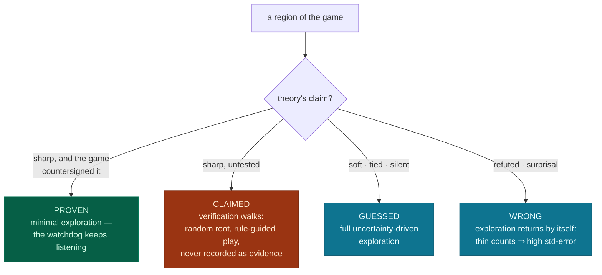
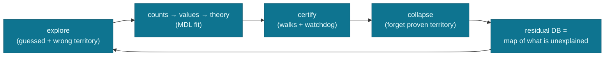

# Certificate-aware exploration: spend games where the theory is weak

> Status: design, building on [certified-forgetting.md](certified-forgetting.md).
> Validated pieces are marked; the budget mechanism itself is the next experiment.

## The question

Exploration currently treats every region of the game the same way: visit whatever is
most uncertain in the *statistics*. But by mid-training the system also has a theory —
the rule library — and the theory knows things. Some regions it prices confidently and
correctly; some it prices confidently and wrongly; some it cannot price at all. Can
exploration use that knowledge to spend its games better?

One version of this was already tested and rejected: letting the theory's *opinions*
steer play ("explore the moves I price highly") collapses — play concentrates in
corridors the theory already likes, coverage of everything else starves, and a wrong
theory walls itself off from the evidence that would correct it. This design uses a
different input: the theory's **self-assessment**. Not "this board is winning" but
"here I am sure; here I am guessing; here I was already proven wrong."

## The theory's self-assessment is already computable

| signal | where it comes from | what it means |
|---|---|---|
| sharp claim | leaf value near 0 or 1 | the theory commits to an outcome |
| soft claim | leaf value near ½, mixed masses | the theory is guessing |
| tied moves | several moves priced equal-best | the theory can price but cannot navigate |
| refuted board | a rollout or training game disproved the claim | the theory is wrong here, specifically |
| surprisal row | stored value the rules fail to reproduce | unexplained evidence |
| no opinion | no rule matches | the theory is silent |

Together these split the game into territories: **proven**, **claimed**, **guessed**,
and **wrong**.

## The trap, stated plainly

A wrong theory is usually *confidently* wrong. If exploration trusts self-assessed
confidence, it will skip exactly the regions that most need testing — the confident
errors. The earlier failure steered play *toward* what the theory liked and starved the
frontier; trusting raw confidence would steer play *away* from what the theory asserts
and starve the audit. Same disease, opposite door.

## The rule that makes it safe

> **Confidence alone diverts nothing. Only confidence the game has countersigned — a
> certificate — may reduce exploration.**

A certificate (see [certified-forgetting.md](certified-forgetting.md)) means the
theory's claim survived direct play: terminal claims checked against the game's verdict,
interior claims defended through adversarial rollouts. Certified regions have *earned*
reduced attention. Everything else keeps full uncertainty-driven exploration, untouched.
And certified regions stay under watch for free: every training game that passes
through one cross-examines its claims (the watchdog, below).

## The budget, by territory

| territory | theory's state | policy | cost |
|---|---|---|---|
| proven | sharp claim + certificate | skip; audit rides along on normal play | ~zero |
| claimed | sharp claim, untested | verification walks to issue (or refute) the certificate | capped rollout budget |
| guessed | soft, tied, or silent | uncertainty-driven exploration, exactly as today | unchanged |
| wrong | refuted claims, surprisal rows | exploration concentrates here automatically | unchanged |

The freed games from *proven* territory are spent on *claimed* and *guessed* territory.
The theory's only new power is to declare — with the game's countersignature — which
territory no longer needs attention.

## Verification walks

A verification walk starts from a root chosen by the normal uncertainty rule, then both
seats play the theory's best moves to the end of the game. This is a rollout with a
randomized root. It serves one purpose: testing sharp, untested claims. Every claim on
its path is checked against the final result, so one walk tests a whole chain
(path-crediting, validated on Nim and TTT).

Verification walks are **never recorded as evidence**. Recorded games shape the counts,
the counts anchor the values, and the values train the theory — so a theory that
records its own guided games would be grading its own homework. Walks stay on the
verification side of the ledger; the counts stay theory-blind.

## The watchdog (validated)

Ordinary training games audit certificates for free. The key asymmetry, measured on
TTT:

- **Refutation is cheap.** A sharp claim says "my side wins from here, against any
  opponent." If the claimed winner plays the theory's own best moves at every turn and
  still loses, the claim is disproved — the opponent's quality is irrelevant, so
  ordinary exploring opponents are fine. 500 training games yielded 218 sound
  refutations at zero extra cost (the per-move prices are already computed during
  selection).
- **Confirmation is expensive.** A win against an exploring opponent proves little —
  the opponent may simply have blundered. Confirmation requires *both* seats to play
  theory-best, which exploration almost never does for more than a move (measured:
  median consistent suffix = 1 ply). Issuing certificates therefore stays with
  dedicated verification walks.

One sentence of nuance: "plays the theory's best moves" means the theory's argmax, so a
refutation sometimes convicts a theory that priced a board correctly but cannot
navigate from it (tied moves hide the winning continuation). That outcome is safe and
deserved: the certificate's promise is "I can price this region *and defend the price
in play*" — a theory that cannot navigate does not contain the knowledge the deleted
rows contained, and the rows stay stored.

## Why this closes the loop

Each pass shrinks proven territory's cost to zero and points every remaining resource —
games, walks, rows — at the frontier where the theory is weak, wrong, or untested.
Compression stops being only a memory win: the map of what remains stored *is* the
exploration target. A complete theory (Nim) drives the map to empty. A partial theory
(TTT) holds a stable frontier — and the frontier is exactly where discovery should dig.

## What the experiment must show

1. **No harm:** with budget reallocation on, play converges at least as fast as the
   uniform baseline (games-to-optimal on Nim; optimal-rate curve on TTT).
2. **A benefit:** certification coverage grows faster, or the same play quality arrives
   in fewer games, because no games are wasted on proven territory.
3. **The gate (make-or-break):** corrupt a certified region, with exploration now
   avoiding it. The watchdog — refutations harvested from games that merely pass
   through — must still catch and revoke the corruption. If it cannot, reduced
   exploration in certified territory is unsafe and the design fails.
