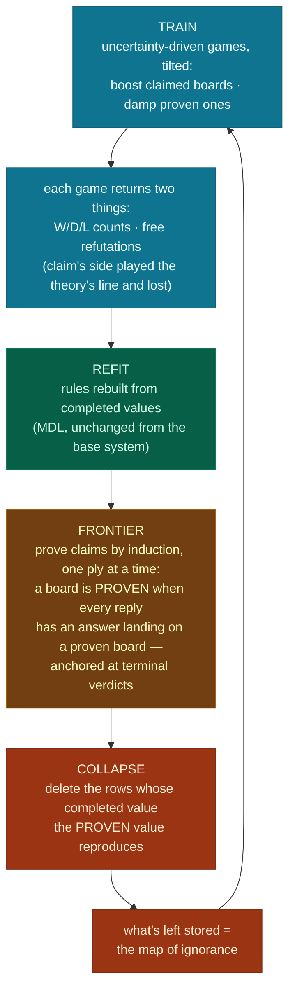

# v3 — the unified loop: steer, prove, forget

> Status: validated on Nim-4 and Tic-Tac-Toe (`scripts/memory_collapse_toy_v3.py`);
> measured results at the bottom. v1 validated collapse + self-heal, v2 validated
> steering; v3 composes them and replaces rollout confirmations with proofs.

## The whole idea in one paragraph

The system runs **one loop with one game budget**. Training explores by uncertainty,
tilted toward boards whose claims need evidence. Refutations fall out of those games
for free. Confirmations never come from games at all: a **certified frontier** grows
backward from the ends of the game, proving claims one ply at a time by exhaustive
check — computed, not played. Certificates that survive a couple of cycles license
deleting the rows they reproduce. What remains stored is the map of what the theory
cannot yet explain — and that map is exactly where exploration is pointed.

## The loop

Every arrow is something already built: the tilt (v2), the harvest check (free —
selection already computes the prices), the refit (the base system), the frontier
sweep (`reply_graph` + batched pricing, the completion machinery pointed at proving
instead of filling), the collapse (v1).

## Three grades of certificate

| grade | how | strength | cost |
|---|---|---|---|
| terminal | compare the claim to the game's own verdict | **proof** | free |
| inductive | exhaustive one-ply check against already-proven boards | **proof** | one vectorized sweep per cycle |
| rollout | k adversarial playouts | k-tested, probabilistic | only for claims far ahead of the frontier — optional, unrecorded |

The frontier replaces almost all rollouts. Deep claims are not confirmed by walking a
perfect-play tightrope end to end; the tightrope is decomposed into one-ply links, each
checked exhaustively, chained back to terminals by induction. On Nim this amounts to
the system proving Bouton's theorem layer by layer.

## Why nothing grades its own homework

- **The theory only nominates.** "I claim this board is a win — check it." Its prices
  appear nowhere inside the verification.
- **Proofs contain no play.** The frontier check enumerates *every* legal reply —
  including exactly the refutations a theory-guided opponent would never find. There
  is no policy to bias.
- **Training stays theory-blind in HOW it moves.** The bright line, once: the theory
  may choose **where** recorded games go (the tilt), never **which move is good**
  inside them. Steering toward a wrong claim increases the traffic that can disprove
  it; rule-playing through one would suppress exactly that traffic.

## Two powers, one standard of proof

| power | reversibility | requirement |
|---|---|---|
| steer (boost/damp) | a few misdirected games, fully reversible | any certificate |
| delete (collapse) | costs re-exploration to undo | a certificate that is a **proof** |

Earlier designs needed an age gate here: rollout certificates are probabilistic and
churn with the theory (v1 deleted on a one-cycle-old surge of them and regressed; the
next cycle revoked 698 of the 783). Proofs dissolve the problem — a fact cannot churn,
so it may delete on the day it is established, and the aging/revocation machinery
disappears with the risk it managed.

## What the pieces already measured

| piece | result |
|---|---|
| collapse (v1, Nim) | 594 rows → 0 at exactly optimal play; corruption at 0 rows self-heals in one chunk |
| collapse (v1, TTT) | 63% of rows deleted; gate exposed eager deletion (regression to 208/300) |
| steering (v2, TTT) | no harm · 1.5× new-board discovery · corruption dents play to 172/300 instead of 50 · gate PASS |
| harvest | refutations free and sound; deep confirmations impossible from training play — hence the frontier |

## What v3 showed (measured)

A simplification fell out during implementation: **proofs need no ages and no
revocation.** An inductive certificate is a game-theoretic fact — a refit cannot
invalidate it and a corrupted library cannot fool it. The age gate, the revocation
pass, and the refutation ledger all existed to manage *probabilistic* certificates;
with proofs they disappear. Collapse also strengthens: rows are compared against the
**proven value**, not the library's price, so deletion stays sound even while the
theory is wrong.

| | Nim-4 | Tic-Tac-Toe |
|---|---|---|
| frontier coverage | 120/120 stored boards, one sweep | 2,192/4,400 at setup → 5,234 after four chunks (steered discovery feeds the frontier; +~700/chunk) |
| verification cost | **zero playouts** (v1/v2 spent 193) | **zero playouts** (v1/v2 spent 6,188 + ~1,400/cycle) |
| memory | 594 rows → 0, every cycle | 7,108 → ~3,000, deepening as the frontier grows |
| play | 96/96 throughout | 226–231/300, steady |
| gate (corrupt the theory) | 8/96 → 96/96 in one chunk; proofs untouched | 51/300 → 223 in one chunk; frontier kept growing **through** the sabotage; PASS |
| wall time (full protocol) | seconds per cycle | **~6 min** (v1: ~26, v2: ~21) |

On Nim the system proves Bouton's theorem by induction over its own certificate set,
then forgets the entire transition table.

Two insights from the run, both pointing at the next iteration:

1. **Proofs should write bell.** The kept "exceptions" grew over cycles (587 → 2,624
   on TTT) — they are rows whose completed value drifted from proven truth as the
   graph thinned. Ground truth is strictly better than a backup: pinning proven
   boards to their proven values inside `complete_values` would drain the exceptions,
   deepen the collapse, and sharpen the value signal in one move.
2. **The proof set is a free, exact audit of the theory.** `|L(b) − proven(b)|`
   over proven boards measured the TTT library mispricing ~30% of them — matching
   the ~31% the rollout era found by playing games, now computed in one vectorized
   pass per cycle. Those mispriced-but-proven boards are also a ready-made target
   set for discovery: ground-truth labels the MDL search could fit directly.
