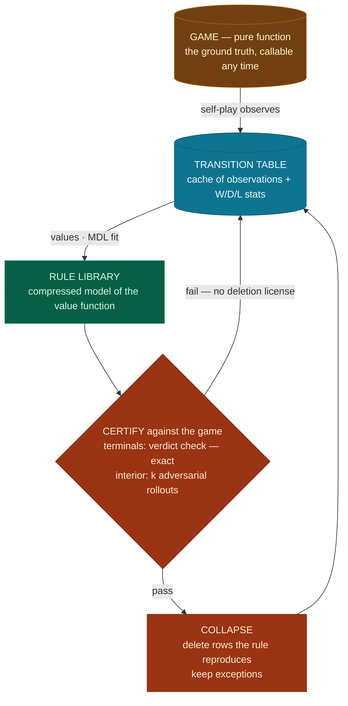

# Certified forgetting: collapsing transitions into rules

> Status: concept validated on a toy (4-pile Nim, `scripts/memory_collapse_toy.py`),
> not yet part of the main system.

## The principle

The transition table is a **cache, not the ground truth**. The game is a pure
function, callable at any time; every stored transition is a memoized observation of
it. A rule, in turn, is an **executable claim** about that function ("boards with
nim-sum 0 are winning") — which means the game itself can confirm or refute it on
demand.

This licenses a strong form of forgetting: once a rule is *certified* to reproduce a
set of cached observations, those cache entries carry zero information beyond the
rule and may be deleted. In MDL terms, the stored data is exactly the second term of
the two-part code:

$$\text{DB size} \;\approx\; |D \mid \text{theory}|
\qquad\Rightarrow\qquad \text{true theory} \implies \text{DB} \to 0$$

Statistics flow *into* rules; certified rules *replace* their statistics. What
remains stored is precisely what the theory cannot explain.

## The cycle



## The deletion invariant

**A row may be deleted iff a named guarantor can reproduce it.**

| rows onto… | guarantor | check | strength |
|---|---|---|---|
| terminal boards | the game's verdict | `L(b) = verdict(b)` | exact, free |
| interior boards | a certified rule (+ `complete_values`) | rollout certificate **and** `\|V_completed(b) − L(b)\| ≤ ε` | probabilistic — survived *k* refutation attempts |

Two tests that are **not** sufficient, and why:

- *Rule agrees with its own completed values.* Circular — completion used the rule
  to produce those values; a confidently wrong rule agrees with itself. The
  certificate must come from the game (rollout: play the rule's implied strategy
  from the board, bilaterally, and check the predicted outcome actually occurs).
- *Rule agrees with the raw W/D/L tally.* Wrong quantity — tallies are
  mixed-play-quality averages and never match a sharp minimax prediction (measured:
  this test wrongly retains ~⅔ of rows). The quantity a rule claims to reproduce is
  the row's **completed value**.

A certificate is never permanent: it means "survived k refutation attempts," and
certified regions are re-audited on the existing doubling cadence (O(log n) audits
per run).

### What a rollout is, concretely

Certifying `b = [1,2,3,0]` (nim-sum 0, so `L(b) = 1.0`). The claim, after unwinding
the mover-perspective convention: *the player who must move from `b` loses*. Start
the game at `b`, opponent to move, both seats rule-guided (price every legal move's
resulting board with the library, take the max, ties random):

| position | to move | library-guided choice |
|---|---|---|
| `[1,2,3,0]` xor=0 | opponent | all moves leave xor≠0, all priced 0 → random, say `[1,2,1,0]` |
| `[1,2,1,0]` xor=2 | creator's side | the move to xor=0: `[1,0,1,0]`, priced 1.0 |
| `[1,0,1,0]` xor=0 | opponent | again all priced 0 → say `[0,0,1,0]` |
| `[0,0,1,0]` xor=1 | creator's side | takes the last object — **wins, as predicted** |

Repeat k times (random tie-breaks vary the lines); all k must confirm. This is
property-based testing: the rule is a property, each rollout an executed test case,
a certificate = "survived k attempted counterexamples." The outcome is decided by
the game's dynamics, not by any signal's opinion — which is what makes it
non-circular. Known limit: both seats share one library, so a wrong theory faces an
equally deluded adversary (the 20/119 control leak) — hence adversary diversity,
re-audits, and the surprisal channel behind it. On toy games the certificate can be
upgraded to exact (full minimax solve below `b`); at scale it stays Popperian.

## The failure case: certified early, wrong later

Scenario: a rule is certified, its rows are deleted, and a later observation
disproves it (in this domain disproof can be *structural*, not just statistical — one
newly discovered reply can flip a minimax value deterministically).

The key fact making this recoverable: **deletion loses cache, never truth.** The
game is replayable, so evidence is a renewable resource; the worst case is
re-exploration compute, not permanent loss. The repair chain uses only existing
machinery:

```
wrong rule → new observations disagree with it → stored (high surprisal is exactly
what memory keeps) → region has rows with thin counts → std-error high →
uncertainty-driven exploration returns on its own → next refit rebuilds rules from
scratch against evidence-anchored values → wrong rule does not survive → re-certify
```

So forgetting does not require the "100% certainty" it intuitively seems to. It
requires two weaker properties the system already has: **error detectability** (the
surprisal channel — a wrong rule cannot suppress the disagreeing observations that
convict it) and **evidence recoverability** (the game as oracle).

## Measured (toy: 4-pile Nim, 96 winning positions, exact eval)

| step | result |
|---|---|
| baseline (2,000 games) | 594 rows · play 96/96 · nim-sum discovered (2 rules) |
| certify | 119/119 interior boards + the terminal pass |
| negative control (inverted library) | 20/119 rollout-certified, 0 terminals — rollouts mostly catch it; audits + surprisal cover the residue |
| **collapse** | **594 → 0 rows · play 96/96** — two rules carry the entire game |
| corrupt the theory at 0 stored rows | play 8/96 (knowledge was 100% structural) |
| +400 games | play 96/96 · library repaired · re-collapsed to 0 · steady state thereafter |

The negative-control leak (20/119) is the known weakness of bilateral self-play
rollouts: two seats sharing one wrong theory can blunder symmetrically. Mitigations:
adversary diversity in rollouts, periodic audits, and the surprisal channel — which
caught the full corruption above despite zero stored evidence.

## Open items

1. **Surprisal-gated writes** — the toy deletes after writing (~500 rows of churn
   per cycle); the real version checks at record time and never stores what a
   certified rule predicts. Makes recording theory-dependent, so it needs the
   echo-guard analysis; the corruption-recovery result above is the evidence the
   channel tolerates it.
2. **The boards table** — same logic, next collapse target (still O(visited)).
3. **Partial theories** — Nim is the clean limit (theory fully true). On a game
   like Tic-Tac-Toe the table should empty exactly where the theory holds and stay
   dense where it doesn't: DB size becomes a per-region map of what the system does
   not yet understand — and therefore a target function for exploration and
   discovery. That closes the self-improvement loop: compression frees memory,
   residual memory marks ignorance, exploration attacks the residual.
