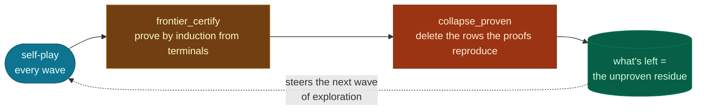
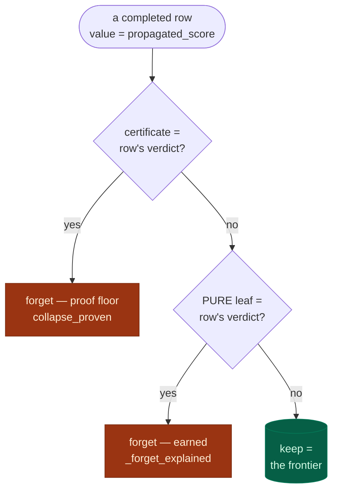

# Certified forgetting: rules replace transitions

The transition table is a **cache, not the ground truth.** The ground truth is the game —
a pure function you can call any time; every stored transition is a memoized observation of
it. A rule, in turn, is an **executable claim** about that function ("boards with nim-sum 0
are winning"), so the game itself can confirm or refute it on demand.

This licenses a strong form of forgetting: once a rule's value for a region is *proven
against the game*, the stored rows in that region carry no information beyond the rule and
can be deleted. In MDL terms the database is exactly the residual of the two-part code:

$$\text{DB size} \;\approx\; |\,\text{data} \mid \text{theory}\,| \qquad\Rightarrow\qquad \text{a true theory drives it to zero.}$$

Statistics flow *into* rules ([concept-invention.md](concept-invention.md)); proven rules
*replace* their statistics. What remains stored is precisely what the theory cannot yet
account for.

Entry points: `frontier_certify` (the proof pass) and `collapse_proven` (proof-floor deletion,
every wave), plus `_forget_explained` (the theory's *earned* deletion, on the rebuild clock —
it reads the freshly fit rules).

## Where it runs

Prove + forget is the **cheap tier** of the value loop ([value-loop.md](value-loop.md)): it runs
**every wave**, so the certified frontier creeps forward continuously. It needs no refit — only
the reply graph — which is why it can run so often. (The expensive rebuild that *discovers* the
rules runs only on the games-doubling clock; certify + collapse just ride on top.)

## Proof by induction — the frontier

A claim like "the creator of board `b` wins" is recursive: it means *every* opponent reply
from `b` can be answered by a move into a position that is *also* a creator-win. So instead
of proving the whole game tree at once, the frontier certifies **one ply at a time, anchored
at the terminals**:

> A board is **proven** once every legal reply is proven (or terminal), and its value is then
> the exact backup `1 − max(reply values)`.

Terminal boards are proven directly from the game's verdict. Depth-1 boards certify against
the terminals; depth-2 against the now-proven depth-1 layer; the certified frontier creeps
backward from the end of the game, one exact step at a time. A board proven this way carries
a **proof**, not an estimate. On Nim the frontier amounts to proving Bouton's theorem by
induction over the certificate set.

**Nothing the theory believes enters the check.** The theory only *nominates* boards to
test; the game supplies the legal moves and the terminal verdicts; prior certificates supply
the inductive hypothesis. There is no play policy anywhere — nothing is sampled, no seat
"plays" — so there is nothing for a wrong theory to bias, and *every* reply is enumerated,
including the refutations a theory-guided opponent would never play. This is why an inductive
certificate is a fact, not a probability. (`frontier_certify` reuses the value loop's
`reply_graph` enumeration and runs as one vectorized fixpoint sweep — zero playouts.)

Earlier prototypes certified interior boards with **adversarial rollouts** (k bilateral
rule-guided playouts per board). That works but is probabilistic — two seats sharing one
wrong theory can blunder symmetrically and "confirm" a false claim (~20% leak measured on
an inverted library) — and it costs thousands of playouts per cycle. The inductive frontier
replaced it: proofs instead of probabilities, and the verification bill dropped to zero.

## The deletion invariant

> A row may be deleted iff an **exact-anchor explanation** reproduces its outcome — a
> **proof** (its certificate) or a **theorem** (a pure rule-tree leaf). A coincidental lump
> never licenses deletion.

A board's value `v ∈ [0,1]` is a sliding scale — the minimax backup, e.g. `0.68`. Its
**verdict** is which of the game's three outcomes that value is nearest:

$$\text{verdict}(v)=\begin{cases}\text{LOSS}&v\le\tfrac14\\[2pt]\text{DRAW}&\tfrac14<v<\tfrac34\\[2pt]\text{WIN}&v\ge\tfrac34\end{cases}$$

The cuts at `¼` and `¾` aren't tuned — they're where the loss/draw/win masses cross in
`_verdicts`. The two things that can *license* a deletion are always exact anchors (`0`, `½`,
`1`): a **certificate** is a proof, and a **pure leaf** is a theorem — a leaf whose boards are
all one outcome (`avg` lands exactly on an anchor). An **impure leaf** (`avg≈0.33`) is a mix
the concepts couldn't separate; it explains nothing, so its rows are kept. The row's own backup
only has to land on the right side of the scale — never exactly on `½` — so no tolerance is
tuned. Each completed row runs two gates in turn:

**Safe either way.** The proof floor compares against the *certificate* (the game's truth,
never the library), so no theory can force a wrongful delete. Earned forgetting deletes only
against a *pure* leaf — a region the concepts turned into a theorem — and only where it agrees
with the backup, so a wrong or half-formed theory forgets less, never wrongly, and can never
expand what's certified. An impure leaf is held as frontier, which is exactly why a washed-out
region (a game so deep the backup sits at `≈½` everywhere) is never mistaken for explained. On
a provable game the proof catches up and the gates converge; on one too large to prove out,
earned forgetting compresses only the regions it has genuinely proven into theorems.

`WISE_COLLAPSE=0` disables both gates; the cycle still completes and values stay sound, just
with redundant rows retained.

## Impurity is a tactical obligation, not a defect

A leaf need not be pure. The library has two jobs: turn the **reusable** structure into theorems
(the pure leaves) and leave the **irreducibly tactical** positions for the proof. An impure leaf
marks that boundary — an obligation handed to the proof, not a failure to classify.

On solved Tic-Tac-Toe the library splits the reachable positions into a clean won region, a clean
lost region, and one impure lump: the contested middlegame, mixing losses and draws. No static
feature separates that lump, because the line between a loss and a draw there *is* the minimax
decision:

$$\text{the just-moved player loses} \iff \text{the side to move can force a win} \iff V_{\text{minimax}}(\text{to move}) = \text{WIN}.$$

A feature that cleanly split it would therefore *be* a search. So the library correctly declines,
keeps the lump as frontier, and the proof settles it position by position. The standard to judge
the whole system by follows — not leaf purity, but joint certification:

$$\text{correct} \;\not\Leftrightarrow\; \text{every leaf pure} \qquad\qquad \text{correct} \;\Leftrightarrow\; \text{theory} \,\wedge\, \text{proof together certify play.}$$

On a game small enough to prove out, they do (Tic-Tac-Toe, 100%); on one too large, the theory
certifies what generalizes and the residue maps what the proof has yet to reach.

## Proofs need no expiry

A certificate here is a game-theoretic **fact**, which dissolves machinery earlier designs
needed. A fact cannot churn, so it requires no aging before it earns deletion rights and no
revocation pass when the theory is refit — both of which existed only to manage *probabilistic*
rollout certificates. And because completion pins proven boards to their certified values, a
proof *improves* the targets discovery fits, rather than merely sitting beside them.

## Steering: the residue is the itinerary

The stored residue is a map of where the theory is incomplete, and exploration reads it.
Training-time selection drives each move by its **total remaining uncertainty** — statistical
noise and theory–evidence disagreement in quadrature, and **zero once the board is proven**:

$$\text{drive} = \begin{cases} 0 & \text{proven — nothing left to learn} \\ \sqrt{\,\mathrm{se}^2 + (\text{concept} - \text{stat})^2\,} & \text{the theory makes a claim} \\ \mathrm{se} & \text{the theory is silent} \end{cases}$$

This is parameter-free and **direction-blind**: the theory enters only through the
*magnitude* of its disagreement with the evidence, so it pulls games toward boards where it
is informative and untested — never toward boards it merely favors. A confidently wrong claim
attracts exactly the games that refute it; a confirmed claim fades to plain `se`, then to
zero at proof. Measured on Tic-Tac-Toe, steering discovers ~1.5× more new boards per game than
uniform exploration with no loss of play strength.

**The bright line.** The theory may choose *where* recorded games go; it must never choose
*which move is good* inside a recorded game. Steering toward a wrong claim multiplies the
traffic that can disprove it; letting the theory *play* the recorded games would instead
suppress the refuting replies and feed its own errors back as evidence (measured: recorded
rule-guided play echoes — the clean-room collapse). So steering tilts the sampler; the moves
themselves stay uncertainty-driven, and the raw counts stay independent of the theory.

## Self-healing

Forgetting does not require certainty — only two properties the system already has:
**error detectability** (a wrong rule cannot suppress the observations that convict it, since
training is theory-blind) and **evidence recoverability** (the game is replayable, so a
wrongful deletion costs re-exploration, never knowledge).

The hard test: corrupt the theory *after* its supporting rows are gone. Play craters — on
Nim-4, where the table is empty, it falls to 8/96. One training cycle refits the rules from
fresh evidence (the corrupted rule does not survive contact with the observations that
disagree with it) and play returns to 96/96. The proofs never wavered through any of it —
they are facts, and deletion stayed sound against them the whole time.

## Measured behavior

| | complete theory (Nim-4) | partial theory (Tic-Tac-Toe) |
|---|---|---|
| frontier proves | all 120 stored boards, one sweep | 2,192 at setup → ~5,452 (nearly all 5,478) |
| memory | **594 rows → 0**, every cycle | **7,108 → 0** (proves through) |
| play | 96/96 optimal throughout | 300/300 optimal |
| verification cost | **zero playouts** | **zero playouts** |
| corruption gate | 8/96 → 96/96 in one cycle | refits to 300/300 in one cycle |

Forgetting tracks where the **proof** has reached: a game small enough to prove out empties
entirely — Nim *and* Tic-Tac-Toe — while a game too large to prove out (minichess) keeps a
dense residue that maps what's still unproven. Either way the certificates are a free, exact
audit of the *library*: `|library(b) − proven(b)|` over proven boards measured the TTT library
mispricing ~30% of them — matching the ~31% the rollout prototype found by playing games.

**The champion gate: forgetting can't wash out the best theory.** That audit is also a *gate*.
Discovery refits the rule tree each cycle — but once the proof has emptied the rows (above), a
refit has almost no data left and comes back as a near-empty stub. So a rebuild replaces the
library only if it predicts the certificates with *strictly lower* error than the reigning tree;
otherwise the reigning tree stays. The certs are a held-out answer key the tree never fit, so the
best-generalizing theory survives even as forgetting deletes every proven row. A toy with four
proven boards (a board the tree can't value reads as the neutral 0.5, as a missing rung does in
selection):

| proven board | certificate | reigning tree | post-collapse stub |
|---|--:|--:|--:|
| b₁ (win)  | 1.0 | 1.0 | 1.0 |
| b₂ (loss) | 0.0 | 0.0 | 0.5 |
| b₃ (draw) | 0.5 | 0.5 | 0.5 |
| b₄ (win)  | 1.0 | 1.0 | 0.5 |
| **mean `\|pred − cert\|`** | — | **0.00** | **0.25** |

The stub only covers b₁; the rest fall back to 0.5, so it errs on the loss and a win → 0.25 >
0.00, loses, and is discarded. Parameterless (lower error wins; ties keep the incumbent;
`WISE_CHAMPION=0` disables it). It's a ratchet, not a freeze — a genuinely better-generalizing
tree still takes the title — but once the game is proven and its data forgotten there's nothing
left to learn, so the best theory simply stands. Measured (TTT, cumulative to 5k, collapse on):
with the gate the tree holds at 14–18 rules and 100%; without it it caves 15 → 8 → 3.

**The evidence ladder beats the old arbitration.** Ablating the deleted machinery (hiding
the four-signal stack's bell + anchors from competitive selection, leaving only
proven > concept > statistics) was an A/B from identical (pre-fix) Tic-Tac-Toe snapshots,
same seeds. The ladder *improved* play at every checkpoint (237 vs 231 at setup, 238 vs 226
and 234 vs 226 over two cycles) and degraded *less* under corruption (80/300 vs 51/300) —
the fix lifts both arms, so the per-arm delta is what isolates the ladder's effect —
because the old bell signal is filled by the library where coverage runs out, so a
corrupted theory flows through it, while raw counts are theory-blind and cannot be
poisoned. Anchors earned nothing measurable. This is why competitive play ranks the
ladder and `bell` survives only as discovery's internal fit target.

**Scale (1,000-game probes).** Nim-6 (5,040 positions): theory found, 2,567 boards proven,
40% collapsed, corruption recovered in one cycle. Nim-8 (362,880 positions, single run,
replication pending) taught two things: steered discovery found the nim-sum in ~1,600 games
and reached 200/200 play, where the unsteered baseline finds nothing in 3,000; and the
audit's authority is proportional to frontier coverage — with proofs over only a 0.7%
near-terminal shell, a shell-fitting theory can pass the audit while playing poorly. The
safety floor held throughout: a weak theory is never granted deletion authority, because
collapse answers to proofs, not to the library.

## Honest limits

- **Frontier-bounded.** A board certifies only once its whole reply layer is certified, so
  deep claims wait. On a coverage-limited game (8-pile Nim) the frontier reaches only the
  endgame shell; that is also where statistics are weakest, so the two cover different
  regions rather than the same one.
- **Cyclic games.** The induction assumes replies chain to terminals. Positions with
  repetition (minichess) never satisfy the all-replies-proven condition and are simply left
  unproven — `solve_graph`'s value iteration still handles their values; a fixpoint variant
  of the frontier is the open path.
- **Zero-sum proofs.** The proof backup uses the pure `1 − max` form; the cross-player
  alignment factor α ([value-loop.md](value-loop.md)) would need threading through the
  induction for non-zero-sum proofs.
- **Side to move.** A board's replies are the moves of the player to move, read off its
  transitions (the placed piece names its mover). This is exact when the board reveals its
  mover (piece-owning games like Tic-Tac-Toe) or its moves don't depend on turn (Nim, which
  falls back to the seat-agnostic set); a turn-dependent game with neutral pieces would need
  the mover supplied explicitly. Merging both seats is *not* a safe superset — the opponent's
  reply enters the `1 − max` and certifies a forced win or threatened draw as a loss.

## Where it lives

| piece | place |
|---|---|
| inductive proof pass | `TransitionMemory.frontier_certify` |
| proof-licensed deletion (floor) | `TransitionMemory.collapse_proven` |
| earned forgetting (theory) | `TransitionMemory._forget_explained` |
| verdict from value | `synthesis.engine._verdicts` |
| proven-board pinning in completion | `TransitionMemory.complete_values` |
| certificate store / cache | `GameMemory.certified_values` · `certificates` table |
| the steering drive | `selection.select_move_for_training` |
| cycle ordering (prove + forget last) | `GameMemory.grow_concepts` |
| deletion off-switch | `WISE_COLLAPSE=0` |
