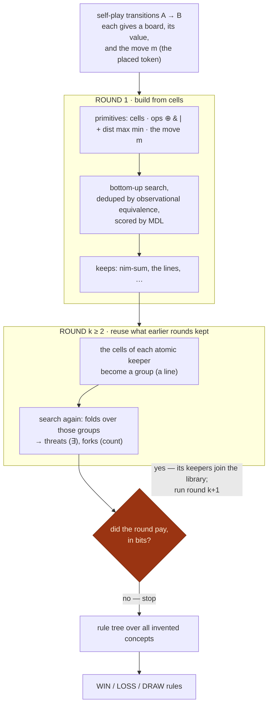
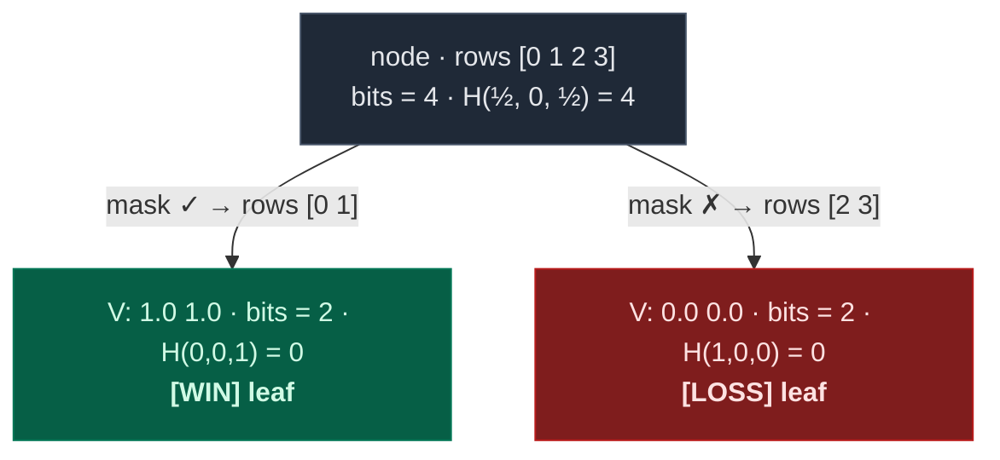
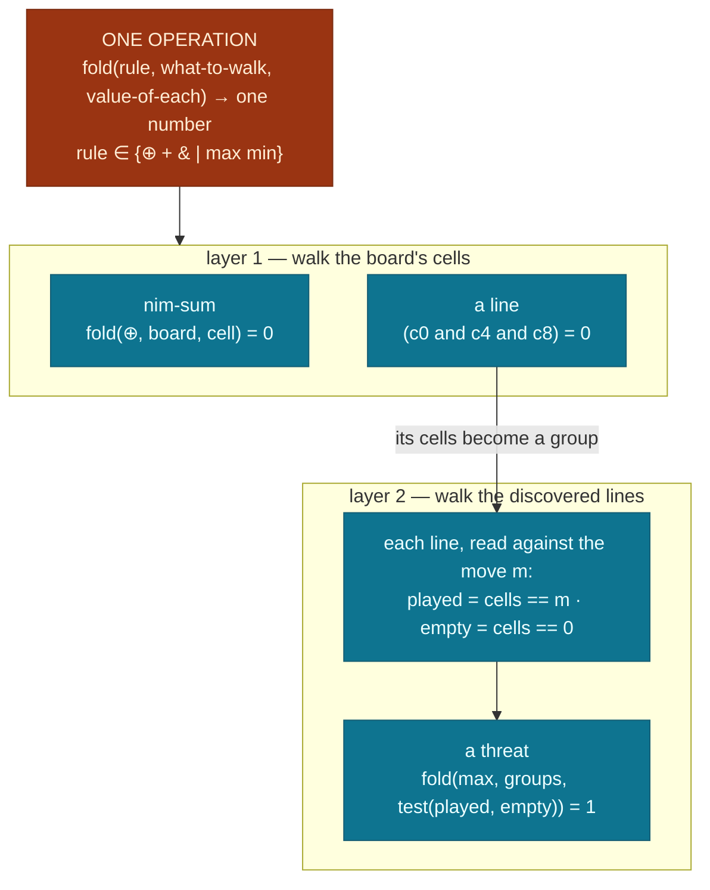

# Concept invention & reuse

> *The learner is never told what a "line", a "threat", or the "nim-sum" is. It builds them
> from arithmetic over the board, keeps the ones that pay for themselves in bits, reuses its
> own discoveries to reach richer ones, and knows when to stop — all under one rule: **prefer
> the shortest description of the data**.*

This note describes the **concept-invention** engine (`wise_explorer/synthesis.py`, exposed as
the `wise-explorer invent` command) — the system's one discovery mechanism. Instead of splitting
on a fixed vocabulary of board features, it **searches for new features to build** out of
generic primitives, scores them by how much they compress the win/loss data, and reuses its own
discoveries to reach concepts that were out of reach from scratch. It runs inside the
[value loop](value-loop.md) — whenever the evidence graph has doubled — and its
discoveries feed competitive move selection as the only signal that generalizes to
boards training never visited.

## The one idea

A concept is **good** if it lets you describe the win/loss data in *fewer symbols*.
`"you win exactly when the nim-sum is 0"` is one short sentence that nails every board — a
great concept. `"you win when cell 3 is empty"` needs endless exceptions — a bad one.

"Bits" makes that exact. Each board's value `V ∈ [0, 1]` contributes *fractional* mass to
the two outcome anchors it sits between — `{0, ½, 1}`, the game's own utility scale, with
no thresholds anywhere (`V = 0.59` ⇒ `0.82` draw + `0.18` win). A set of `n` boards whose
pooled masses are `p_w, p_d, p_l` costs Shannon entropy to write down:

$$\text{bits}(D) \;=\; n \cdot H(D), \qquad H(D) = -\sum_{k \in \{w,d,l\}} p_k \log_2 p_k$$

A pure region (all mass on one anchor) costs 0 bits — nothing left to say — and any shift
in the values moves mass continuously, so sharpness pays *wherever* it sits on the value
axis. (Hard LOSS/DRAW/WIN cuts at 0.40/0.60 were benched against this and lost: same
discoveries, more duplicate concepts, more junk at scale.) A concept earns its keep iff
the bits of data it removes exceed the bits its own description adds:

$$\underbrace{\text{bits}(D \mid \text{library})-\text{bits}(D \mid \text{library} \cup \{c\})}_{\text{data saved}}\;>\;\underbrace{|c| \cdot \log_2 12 \;+\; \Delta\,\text{rule-tree}}_{\text{cost of writing } c \text{ down}}$$

(`|c|` = symbols in the formula, 12 = the alphabet of primitives; the rule-tree term charges
for the extra branches it grows.) This one yardstick — Minimum Description Length — runs at
**three** levels: a *tree split* is kept iff it pays, an *invented concept* is kept iff it
pays, a *whole round* runs iff it produced something that paid.

No magic numbers, no round counter — the loop is a compression fixpoint.

## One operation: the fold

Everything the engine builds is a **fold** — the standard "running total" operation:

> walk a list of items and merge them into a single number with one rule.

Add them up (`+`), keep the biggest (`max`), xor them (`⊕`)… We write it
`fold(rule, what-to-walk, value-of-each-item)`, and it expands to nothing more than

$$\text{fold}(\oplus,\ \text{board},\ \text{cell}) \;=\; c_0 \oplus c_1 \oplus \cdots \oplus c_{n-1}$$

for *whatever* `n` the board has — which is why a fold discovered on a small board is the
identical program on a large one. The only requirement on the rule is that it is a **monoid**:
associative, with an identity to start from (0 for `+`/`⊕`, all-ones for `&`). That is the
entire justification for the operator set `⊕ + & | max min` — they are exactly the rules you
can fold with.

Three everyday concepts are the *same fold under a different rule*:

- fold **`⊕`** over every cell → the **nim-sum**
- fold **`&`** over the cells of a line → **"is this line all one colour?"**
- fold **`+`** over a line, of "is this cell the piece just played?" → **a count**

So "line" and "count" are not hand-coded — they are a fold with `&` or `+`. Nesting folds (a
count inside a per-line test, aggregated across lines) is how richer concepts blossom.

## The move is the only perspective

Every board the learner sees was reached by a **move**, and we read that move straight from the
before→after diff: **the token the move just placed**, call it `m`. That single fact is the
*only* thing the engine is told about "sides" — there is no notion of ownership, no "mine vs
theirs", no turn parity. The board is **never recoded**; every piece keeps its face value. A
line is described by two counts taken *against the move*:

- **played** — how many of its cells hold the just-played token (`cell == m`)
- **empty** — how many cells are blank (`cell == 0`)

A piece that is neither (an opponent's piece, of whatever type) keeps its own value and is
simply not counted — so piece types are never flattened together. Whether "two played and one
empty" foretells a win or a loss is **learned from the value**, never asserted, so the same
machinery is honest for two players, many players, or cooperative games.

## The pipeline



Within every round, the same three stages run. Here is each one at the level of the code.

## Propose: enumeration, not guessing

Candidates are never sampled or guessed. The search builds *every* program, smallest first:
size 1 is the givens (cell reads and the board's literals); the six whole-board folds — one
per monoid — are always offered alongside, which is how `fold(⊕, board, cell)` exists
*before* anything knows it matters; every larger program is `op(a, b)` over two smaller
ones, for all seven operators.

What makes this tractable is **observational equivalence**: a program's identity on the
data is the *column of outputs* it produces, so two formulas with the same column are the
same concept and only the smaller formula survives. Counted on 3-pile Nim (64 boards):

| size | built how | example | distinct behaviors |
|--:|---|---|--:|
| 1 | the givens: cell reads + the board's literals | `c0` · `2` | 7 |
| 2 | the six whole-board folds, always offered | `fold(⊕, board, cell)` | 6 |
| 3 | every `op(a, b)` over smaller programs | `(c0 xor c1)` | 75 |
| 5 | …recursively | `(c0 xor (c1 xor c2))` | 1,669 |
| 7 | …up to the size budget (6,000 kept per size) | | 6,000 |

The formula space collapses to ≈ 13,600 distinct behaviors — the search never spends effort
on a formula that behaves like one it already has — and ranking them all by how much
value-variance they remove is a single vectorized pass.

## Audition: a concept is a mask; a split is a partition

On the data, a program *is* a column (it is evaluated on all boards at once), and a
threshold turns it into a mask:

| board | column: `fold(⊕, board, cell)` | mask: `= 0`? | value `V` |
|---|:--:|:--:|--:|
| `[1, 2, 3]` | 0 | ✓ | 1.0 |
| `[2, 2, 0]` | 0 | ✓ | 1.0 |
| `[2, 1, 0]` | 3 | ✗ | 0.0 |
| `[1, 0, 0]` | 1 | ✗ | 0.0 |

A tree node is **nothing but an array of row indices**; splitting partitions that array by
the mask — no board is ever copied or moved. The node goes to whichever mask saves the most
bits:

$$\text{gain}(c) \;=\; \text{bits}(\text{node}) \;-\; \text{bits}(\text{node} \cap c) \;-\; \text{bits}(\text{node} \setminus c)$$



Here gain = 4 − 0 − 0 = 4 bits, and a split happens only if the best gain beats the price
of *naming* a split, `log₂(#candidates) + 2` bits. A useless mask leaves both children at
H(½, 0, ½) — gain 0, no split.

## Promote: abstraction buys depth

Concepts the tree used join the library: each becomes a **size-1 named block**, and the
cells of each kept region become a **group** the next round can fold over. That is why a
threat — enormous if spelled in raw cells — costs only a few symbols in round 2's language:
round 1 already paid for the lines. Depth is reached by raising the floor, not by searching
deeper.

What survives a run is small and portable: the leaf rules — the tree itself is never
materialised; each leaf simply remembers its root-to-leaf path of (concept, yes/no) tests —
and the *programs*, persisted as JSON. Masks and columns are recomputed on whatever boards
come next, which is why a concept can value a board it has never seen.

## What it builds

Each concept is a small evaluable program, so it is a real feature (it runs on unseen boards)
and renders to a readable formula. The build ladder for Tic-Tac-Toe:

| layer | concept | meaning |
|---|---|---|
| primitive | `fold(rule, what, each)` | walk `what`, merge each item with `rule` — the only structural primitive |
| round 1 (cells) | `fold(⊕, board, cell) = 0` | the nim-sum: xor every cell — width-free, the same program at any board size |
| round 1 (cells) | `(c0 and c4 and c8) = 0` | a line is all one colour (an `&`-fold over those cells, written as a chain) |
| round 2 (lines) | `fold(max, groups, <test of played & empty>) = 1` | ∃ a line passing a *discovered* test — a threat |
| round 2 (lines) | `fold(+, groups, …)` thresholded | how many lines pass it — a fork |
| rules | `win → WIN`,  `threat → LOSS / WIN`,  `else → DRAW` | a leaf is labeled by its heaviest outcome mass — learned from the value, never asserted (play uses the leaf's *value*; the label is for reading) |

The lines a round-2 fold walks are **discovered, not hand-listed**: they are the cell-supports
of the *atomic* concepts round 1 already found (the `(c0 and c4 and c8)` lines). Each line shows the
two face-value counts `played` and `empty`, and the inner test (e.g. `(played dist (played max
empty)) = 1`) is itself found by the same bottom-up search. So a threat is a fold-of-folds,
discovered end to end.

For Nim the whole thing collapses to one fold: `fold(⊕, board, cell) = 0 → WIN` / `≠ 0 → LOSS`.
Nim's only concept folds over *all* the cells — that is not a localised region, so no line layer
ever forms. Its opt-out is an **absence**, not a special case.

### The whole phenomenon in one picture



Three facts pin the picture down:

- **The move is the only perspective** — `m` is the token the last move placed, read from the
  A → B diff. The board is never recoded; other pieces keep their face values, they're simply
  not counted.
- **A fold's domain is one discovered region** (a line), never a union glued from concepts —
  combining regions is the rule tree's job.
- **MDL keeps a fold iff it pays; the value decides WIN/LOSS** — the verdict is learned,
  never asserted.

## Why a loss is dearer than a win

On Tic-Tac-Toe a **win** is an absolute, compact concept ("you completed a line") — the search
finds it instantly. A **loss** is *relative, counted, and conditional*: a line that is two-thirds
one player's with the third open — a near-line — where which side it favours is read from the
value. It needs **counting** (`played = 2`), which has no compact shortcut — and counting only
becomes reachable once the learner **reuses** its round-1 discoveries (the lines) to fold counts
over them. That is the whole reason the feedback loop exists.

## When does the loop stop?

After each round we build the best rule set from everything invented so far and measure the
**residual** (unexplained bits). A round pays iff the bits it saves exceed the bits it costs —
*both* the new concepts' descriptions **and** the growth of the rule set (so shattering the data
into junk leaves is penalised). Representative runs:

**Nim** (2,000 self-play games)

| round | concepts | data saved | cost | verdict |
|---|--:|--:|--:|---|
| 1 | `fold(⊕, board, cell) = 0` | **70** | 12 | ✓ keep |
| 2 | — | **0** | 0 | ✗ **stop** |

The nim-sum already explains everything; round 2 saves nothing → stop after round 1.

**Tic-Tac-Toe** (8,000 self-play games)

| round | concepts | data saved | cost | verdict |
|---|--:|--:|--:|---|
| 1 | the six lines | **667** | 188 | ✓ |
| 2 | line-combinations + threat folds | **186** | 97 | ✓ |
| 3 | — | **104** | 108 | ✗ **stop** (barely) |

The savings collapse while the concept cost climbs; the moment cost overtakes saving, the
round stops paying. (Exact numbers vary per run.)

## When it runs: the loop's boundaries

Discovery has exactly one teacher and one venue: whenever the evidence graph has doubled
(and once more at the end of training), the [value loop](value-loop.md) solves the game
graph from raw counts, heals it with the current library, and *then* runs discovery over
those completed values — the system's best current belief. The search is seeded with the current concepts, so knowledge carries
forward, and a sufficient library self-limits: the MDL gate finds nothing left that pays,
and the search stops itself. Between boundaries the library simply is the last considered
fit. Discovery's data view is bounded (`synthesis.CAP`, a compute budget, not a knob):
past it, the fit runs over a uniform sample — a concept is a program, visible in any fair
sample.

(A continuous per-wave variant — live table, refit every wave, due-and-insufficient search
trigger — was built, benched, and deleted: training-time move selection never reads the
concept signal, so the live fit's only consumer was the loop's healing pass, exactly where
a refit over still-drifting values could transiently collapse the tree and poison one
heal. Measured in docs/value-loop.md.)

## Knowledge transfers across scales

A whole-board fold is **width-free**: `fold(⊕, board, cell)` reads *every* cell of whatever
board it is given, and serializes with no board size attached. So the nim-sum discovered on
4-pile Nim is the *identical program* on 8 piles — and a library can be seeded from another
game's database (`ConceptLibrary.seed_from`): the programs carry over, their worth is re-fit
locally.

Measured (run `wise-explorer transfer --full`):

- **n=4** (120 positions): discovers the nim-sum, plays 96/96 winning positions optimally.
- **zero-shot n=8** (362,880 positions): the n=4 library, with **no n=8 data**, plays
  400/400 sampled winning positions optimally.
- **from-scratch n=8 control**, 3,000 games: never finds the rule; ~chance play. The space
  is too big to discover in, but the rule never needed discovering there.
- **seeded-then-retrained n=8**, 3,000 games: **400/400** — indistinguishable from
  zero-shot. This used to be the honest caveat: refitting on n=8's own coverage-starved
  values *degraded* the library, because a fit can't beat bad targets. The
  [value loop](value-loop.md) removed the bad targets — discovery now fits values the
  concepts have already healed — and retraining at scale became safe.

## Running it

```bash
wise-explorer invent -g nim                  # the persisted library — what play actually uses
wise-explorer invent -g nim --remine         # re-run discovery, with the full bits ledger
wise-explorer invent -g nim --fresh 2000     # train a throwaway demo first, then invent
wise-explorer invent -g nim --expand         # every formula fully spelled out (the chaos)
wise-explorer transfer                       # discover on 4 piles, play 8 piles zero-shot
```

The reader mirrors the search's own compression — names all the way up:

- every discovered **program gets a handle** (`K₁, K₂ …` — one per program; two thresholds
  of the same program share its K),
- the **rules print as one tree**, each split shown once with a derived `⟺` reading,
- the **KEY defines each handle one floor deep** — in the handles of the floor below, never
  re-expanded to raw cells — so a five-floor tower reads as five one-line definitions,
- discovered **regions get nicknames** (`g₁, g₂ …`) and, when the board's stored shape
  supports it, a *derived* place-name (`row 0`, `column 2`, `↘ diagonal`) — geometry read
  from data, never assumed,
- every `⟺` reading is **enumerated from the program** (fold bodies over their finite
  input space; cell `and`/`or` chains over the board's observed token alphabet), never
  hand-labeled. Where no honest reading is derivable, none is printed.

`--expand` undoes all of it and prints the raw nested formulas.

## Honest limits

- **The fold is given; the concepts are found.** The engine provides one primitive (the fold)
  and the rules to fold with — nothing about lines, threats, or ownership. *That* is what
  emerges: lines from `&`-folds over cells, counting from `+`-folds, the threat test from the
  inner search. The move is the only handed-in fact, and it's read from the data, not coded.
- **Counting is position-blind.** A count says *how many* on a line, never *where* — perfect for
  line/count games (Tic-Tac-Toe, connect-four, gomoku), and not the right concept for chess,
  where the square matters. Positional detail lives in the cell-level concepts; counts live in
  folds over them. A game like chess, where a cell encodes piece *type* and ownership is in the
  sign, is also out of reach: the move reveals only one piece and the ops can't recover "all my
  pieces", so the engine simply finds nothing spurious there.
- **Several spellings of the same idea.** Many size-5 programs separate the boards identically,
  so the threat test the search prints (`(played dist (played max empty)) = 1`, say) is one
  arbitrary member of an equivalence class — correct, but not always the most readable.
- **Soft values.** Self-play values are noisy, mixed-quality averages, so loss leaves sit around
  0.3–0.4 rather than 0; the rule *structure* is exact even when the numbers are soft.
- **Discovery is only as good as the values it fits.** On a game too large to cover, the
  *evidence-only* Bellman values stay biased and a fit will happily "explain" their noise
  (measured at 8-pile Nim — and weighting boards by evidence does *not* fix it; the bad
  targets, not the vote counting, are the bottleneck). The [value loop](value-loop.md) is
  the system's answer: discovery fits values the library has already healed, which is what
  makes retraining at scale safe. Where the library knows *nothing*, the limit stands —
  discover where values can converge, transfer to where they can't.

## Lineage

Same family as DreamCoder and Poesia & Goodman's [Peano](https://arxiv.org/abs/2211.15864):
grow a library of reusable abstractions, judge them by compression, reuse them to reach higher
concepts. The difference is the *object*: those systems abstract *proof tactics*; this one
abstracts *board features that explain a value function*.
