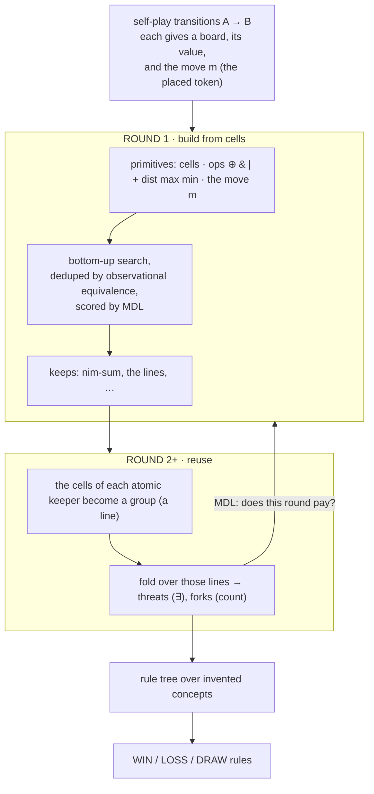

# Concept invention & reuse

> *The learner is never told what a "line", a "threat", or the "nim-sum" is. It builds them
> from arithmetic over the board, keeps the ones that pay for themselves in bits, reuses its
> own discoveries to reach richer ones, and knows when to stop — all under one rule: **prefer
> the shortest description of the data**.*

This note describes the **concept-invention** engine (`wise_explorer/synthesis.py`, exposed as
the `wise-explorer invent` command) — the system's one discovery mechanism. Instead of splitting
on a fixed vocabulary of board features, it **searches for new features to build** out of
generic primitives, scores them by how much they compress the win/loss data, and reuses its own
discoveries to reach concepts that were out of reach from scratch. It runs live while the agent
trains, and its discoveries feed move selection as the only signal that generalizes to boards
training never visited.

## The one idea

A concept is **good** if it lets you describe the win/loss data in *fewer symbols*.
`"you win exactly when the nim-sum is 0"` is one short sentence that nails every board — a
great concept. `"you win when cell 3 is empty"` needs endless exceptions — a bad one.
"Compression / bits" just measures *how much shorter a concept makes the explanation*.

This single yardstick (Minimum Description Length) runs at **three** levels:

1. **a tree split** is kept iff it pays for itself in bits,
2. **an invented concept** is kept iff it pays for itself in bits,
3. **a whole round of invention** is run iff it produces something that pays for itself.

No magic numbers, no round counter — the loop is a compression fixpoint.

## One operation: the fold

Everything the engine builds is a **fold** — the standard "running total" operation:

> walk a list of items and merge them into a single number with one rule.

Add them up (`+`), keep the biggest (`max`), xor them (`⊕`)… (each rule needs a value to start
from: 0 for sum/xor, all-ones for "all match"). We write it `fold(rule, what-to-walk, value-of-each-item)`.

Three everyday concepts are the *same fold under a different rule*:

- fold **`⊕`** over every cell → the **nim-sum**
- fold **`&`** over the cells of a line → **"is this line all one colour?"**
- fold **`+`** over a line, of "is this cell the piece just played?" → **a count**

So "line" and "count" are not hand-coded — they are a fold with `&` or `+`. Nesting folds (a
count inside a per-line test, aggregated across lines) is how richer concepts blossom. `fold`
is the one structural primitive; the operators `⊕ + & | max min` are simply the rules you can
fold with.

## The move is the only perspective

Every board the learner sees was reached by a **move**, and we read that move straight from the
before→after diff: **the token the move just placed**, call it `m`. That single fact is the
*only* thing the engine is told about "sides" — there is no notion of ownership, no "mine vs
theirs", no turn parity. The board is **never recoded**; every piece keeps its face value. A
line is described by two counts taken *against the move*:

- **played** — how many of its cells hold the just-played token (`cell == m`)
- **empty** — how many cells are blank (`cell == 0`)

A piece that is neither (an opponent's piece, of whatever type) keeps its own value and is
simply not counted — so piece types are never flattened together. Whether "two played and one
empty" foretells a win or a loss is **learned from the value**, never asserted, so the same
machinery is honest for two players, many players, or cooperative games.

## The pipeline



**Observational equivalence** is what makes the search tractable: two programs that produce the
*same column of values over all boards* are the same concept — keep the smaller. The space of
distinct *behaviours* on finite data is far smaller than the space of programs.

## What it builds

Each concept is a small evaluable program, so it is a real feature (it runs on unseen boards)
and renders to a readable formula. The build ladder for Tic-Tac-Toe:

| layer | concept | meaning |
|---|---|---|
| primitive | `fold(rule, what, each)` | walk `what`, merge each item with `rule` — the only structural primitive |
| round 1 (cells) | `fold(⊕, board, cell) = 0` | the nim-sum: xor every cell — width-free, the same program at any board size |
| round 1 (cells) | `(c0 & c4 & c8) = 0` | a line is all one colour (an `&`-fold over those cells, written as a chain) |
| round 2 (lines) | `fold(max, groups, <test of played & empty>) = 1` | ∃ a line passing a *discovered* test — a threat |
| round 2 (lines) | `fold(+, groups, …)` thresholded | how many lines pass it — a fork |
| rules | `win → WIN`,  `threat → LOSS / WIN`,  `else → DRAW` | the verdict is **learned from the value**, never asserted |

The lines a round-2 fold walks are **discovered, not hand-listed**: they are the cell-supports
of the *atomic* concepts round 1 already found (the `(c0 & c4 & c8)` lines). Each line shows the
two face-value counts `played` and `empty`, and the inner test (e.g. `(played dist (played max
empty)) = 1`) is itself found by the same bottom-up search. So a threat is a fold-of-folds,
discovered end to end.

For Nim the whole thing collapses to one fold: `fold(⊕, board, cell) = 0 → WIN` / `≠ 0 → LOSS`.
Nim's only concept folds over *all* the cells — that is not a localised region, so no line layer
ever forms. Its opt-out is an **absence**, not a special case.

### The whole phenomenon in one picture

```
            ┌────────────────────────── ONE OPERATION ──────────────────────────┐
  board ──▶ │   fold( rule ∈ {⊕ + & | max min},  what-to-walk,  value-of-each )  │ ──▶ one number
            └────────────────────────────────────────────────────────────────────┘

  CELLS   walk the board's cells
            nim-sum  fold(⊕, board, cell) = 0      line  (c0 & c4 & c8) = 0   ← an &-fold, as a chain
                                                     └── an atomic line the search found BECOMES a group ──┐
  LINES   walk those discovered lines                                                                  ◀───┘
            each line shows two FACE-VALUE counts:  played (cells == the move m)  ·  empty (cells == 0)
            threat  fold(max, groups, <test of played & empty>) = 1      (∃ a line that passes the test)

  THE MOVE is the only perspective: m = the token the last move placed (from the A→B diff).
  The board is never recoded — other pieces keep their values, they're just not counted.
  A fold's domain is always ONE region the search found (a line), never a union glued from concepts;
  combining regions is the rule tree's job. MDL keeps a fold iff it pays; the value decides WIN/LOSS.
```

## Why a loss is dearer than a win

On Tic-Tac-Toe a **win** is an absolute, compact concept ("you completed a line") — the search
finds it instantly. A **loss** is *relative, counted, and conditional*: a line that is two-thirds
one player's with the third open — a near-line — where which side it favours is read from the
value. It needs **counting** (`played = 2`), which has no compact shortcut — and counting only
becomes reachable once the learner **reuses** its round-1 discoveries (the lines) to fold counts
over them. That is the whole reason the feedback loop exists.

## When does the loop stop?

After each round we build the best rule set from everything invented so far and measure the
**residual** (unexplained bits). A round pays iff the bits it saves exceed the bits it costs —
*both* the new concepts' descriptions **and** the growth of the rule set (so shattering the data
into junk leaves is penalised). Representative runs:

**Nim**

| round | concepts | data saved | cost | verdict |
|---|--:|--:|--:|---|
| 1 | `fold(⊕, board, cell) = 0` | **86** | 12 | ✓ keep |
| 2 | — | **0** | 0 | ✗ **stop** |

The nim-sum already explains everything; round 2 saves nothing → stop after round 1.

**Tic-Tac-Toe**

| round | concepts | data saved | cost | verdict |
|---|--:|--:|--:|---|
| 1 | the lines | **~1,770** | 188 | ✓ |
| 2 | line-combinations + threat folds | **~470** | 216 | ✓ |
| 3 | one more combination + a fold | **~20** | 18 | ✓ (barely) |
| 4 | — | **~120** | 200 | ✗ **stop** |

The savings collapse while the rule-set cost climbs; when the cost overtakes the saving, the
round stops paying.

## It runs during training, not after

Discovery is part of the training loop, not a post-hoc analysis. Each wave of self-play
folds only the boards it just touched into a live table (`BoardTable`); the library refits
its rule tree to that table every wave — cheap, so the concept signal always tracks the
current values — and runs an actual *search* only when two things are both true:

- **due** — the table has doubled since the last search (at most a handful of searches per
  run, no tuned interval), and
- **insufficient** — the unexplained fraction of the data rose above the best the library
  has ever achieved. A library that still explains the data does **zero** search.

A search reuses the current concepts as its starting point and its result is accepted only
if it explains at least as much — so a noisy wave can never lose a good concept. When
training ends, one considered pass over the converged Bellman values produces the model
that is persisted (and printed as the post-training summary).

## Knowledge transfers across scales

A whole-board fold is **width-free**: `fold(⊕, board, cell)` reads *every* cell of whatever
board it is given, and serializes with no board size attached. So the nim-sum discovered on
4-pile Nim is the *identical program* on 8 piles — and a library can be seeded from another
game's database (`ConceptLibrary.seed_from`): the programs carry over, their worth is re-fit
locally.

Measured (see `scripts/transfer_demo.py`):

- **n=4** (120 positions): discovers the nim-sum, plays 96/96 winning positions optimally.
- **zero-shot n=8** (362,880 positions): the n=4 library, with **no n=8 data**, plays
  400/400 sampled winning positions optimally.
- **from-scratch n=8 control**, 3000 games: never finds the rule; ~chance play. The space
  is too big to discover in, but the rule never needed discovering there.

The honest caveat: *retraining* the seeded library on n=8's own self-play **degrades** it
(the values at 1.65% state-space coverage are biased, and a refit can't beat bad targets).
Transfer beats retrain; making retraining-at-scale safe is open work — the bottleneck is
value quality, not discovery.

## Running it

```bash
wise-explorer invent -g nim                  # invent from the trained model
wise-explorer invent -g nim --fresh 10000    # train a throwaway demo first, then invent
wise-explorer invent -g tic_tac_toe --fresh 6000
python scripts/transfer_demo.py              # discover on 4 piles, play 8 piles zero-shot
```

It prints, per round: the concepts invented (with their formulas), the rule set they support
(with WIN/LOSS/DRAW verdicts), and the MDL ledger that decides whether to continue.

## Honest limits

- **The fold is given; the concepts are found.** The engine provides one primitive (the fold)
  and the rules to fold with — nothing about lines, threats, or ownership. *That* is what
  emerges: lines from `&`-folds over cells, counting from `+`-folds, the threat test from the
  inner search. The move is the only handed-in fact, and it's read from the data, not coded.
- **Counting is position-blind.** A count says *how many* on a line, never *where* — perfect for
  line/count games (Tic-Tac-Toe, connect-four, gomoku), and not the right concept for chess,
  where the square matters. Positional detail lives in the cell-level concepts; counts live in
  folds over them. A game like chess, where a cell encodes piece *type* and ownership is in the
  sign, is also out of reach: the move reveals only one piece and the ops can't recover "all my
  pieces", so the engine simply finds nothing spurious there.
- **Several spellings of the same idea.** Many size-5 programs separate the boards identically,
  so the threat test the search prints (`(played dist (played max empty)) = 1`, say) is one
  arbitrary member of an equivalence class — correct, but not always the most readable.
- **Soft values.** Self-play values are noisy, mixed-quality averages, so loss leaves sit around
  0.3–0.4 rather than 0; the rule *structure* is exact even when the numbers are soft.
- **Discovery is only as good as the values it fits.** On a game too large to cover, the
  Bellman values stay biased and a fit will happily "explain" their noise (we measured this
  at 8-pile Nim — and also measured that weighting boards by evidence does *not* fix it; the
  bad targets, not the vote counting, are the bottleneck). That is exactly why transfer
  matters: discover where the values can converge, apply where they can't.

## Lineage

Same family as DreamCoder and Poesia & Goodman's [Peano](https://arxiv.org/abs/2211.15864):
grow a library of reusable abstractions, judge them by compression, reuse them to reach higher
concepts. The difference is the *object*: those systems abstract *proof tactics*; this one
abstracts *board features that explain a value function*.
