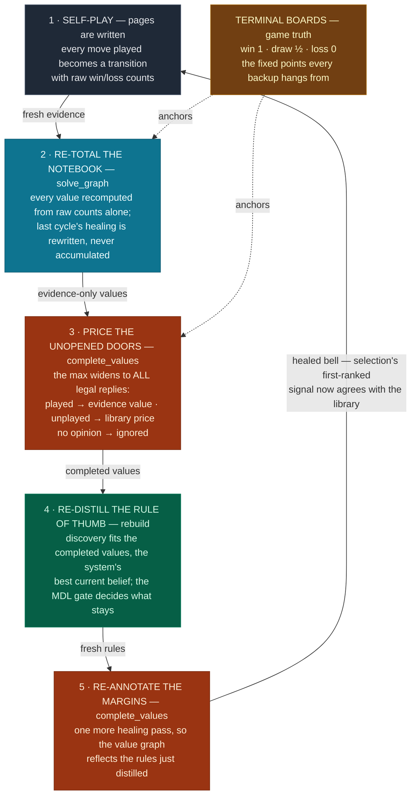

# The value loop

> *Bellman keeps a notebook: exact bookkeeping of every game anyone actually played. The
> concept library is the rule of thumb distilled from that notebook. The loop is what happens
> when the notebook starts citing the rule of thumb for the pages nobody has written yet —
> and the rule of thumb is re-distilled from the notebook it just helped complete.*

This note describes how the discovered concepts feed back into the value graph
(`TransitionMemory.complete_values`, closed by `GameMemory.grow_concepts`). It assumes the
companion note [concept-invention.md](concept-invention.md), which explains where concepts
come from. This one explains what they are *for* during training: turning a coverage-limited
learner into one whose abstractions repair its own value estimates.

## The blind spot

The Bellman backup is a max over replies:

$$V(t) \;=\; 1 - \max_{r \in \text{replies}(t)} V(r)$$

`t` is a board someone just moved onto, `replies(t)` are the boards the *opponent* can move
onto from there, and `V ∈ [0,1]` is always read from the mover's side — landing on `t` is
worth `1` when every opponent reply leads back to positions worth `0` for them. The `1 − x`
is the zero-sum flip: whatever the position is worth to the player facing it, it is worth
the complement to the player who created it.

The stored game graph can only take that max over replies somebody has **played**. On games
small enough to cover, that is exact. At scale it is quietly catastrophic:

| | 4-pile Nim | 8-pile Nim (3,000 games) |
|---|---|---|
| positions | 120 | 362,880 |
| visited | all of them | ~25,000 (7%) |
| max over replies is | the true max | the max over a 7% sample |

A position whose refutation was never played *looks safe* — not because the evidence says
it is safe, but because the evidence never met the door that disproves it. The backup then
**propagates** that false safety to every ancestor: confidently, consistently, and in the
one signal (`bell`) that competitive move selection trusts first. Measured on seeded 8-pile
Nim, this is not a degradation but a collapse: an agent that starts at ~100% optimal (pure
transferred rule, bell still empty) is dragged to ~15% as training *fills* the bell signal
with coverage-biased backups that outrank the still-correct concept signal.

The deep point: the problem was never that the agent knew too little. Its library priced
every position correctly from game one. The problem was a value system that refused to use
that knowledge where the evidence ran out.

## The loop

`complete_values` re-runs the same backup with the max over **all legal replies**. Visited
replies keep their evidence value. Never-played replies are priced by the concept library —
the rule of thumb fills the unwritten pages:

$$V(t) \;=\; 1 - \max_{r \in \text{ALL legal replies}(t)} \begin{cases} V(r) & r \text{ visited} \\ L(r) & r \text{ priced by the library} \\ \text{(ignored)} & \text{library has no opinion} \end{cases}$$

`L(r)` is the library's rule-tree value for board `r` (`ConceptLibrary.values_for`), and "no
opinion" (no rule matches, or the library is empty) means the reply simply doesn't enter the
max — exactly its status today. Terminal boards don't use the max at all: they are fixed at
the game's own verdict for the player who landed there (win `1`, draw `½`, loss `0`) — the
ground truth the whole graph hangs from.

One full training cycle is then a single turn of the wheel — five beats, two kinds of
knowledge feeding each other:

Blue is evidence work (counting what happened), orange is healing (the library lending
prices where evidence ran out), green is discovery (compressing values back into concepts).
The wheel turns once per training cycle, and each kind of knowledge hands the next its
input: evidence grounds the healing, healed values feed discovery, discovered rules heal
the signal that decides actual play. The brown anchor never moves — terminals are the
game's own verdicts, and both value passes hang from them.

**When the wheel turns:** whenever the evidence graph has *doubled* since the last turn,
plus once at the end of training. The cadence decides only **when to ask**; what to do
is still decided by the system at every turn — the MDL search keeps nothing on a
sufficient library, and the heal prices only what the rules actually match. A
"smarter" trigger would have to watch some signal for *when knowledge has changed*, and
every such signal needs its own threshold (a pure insufficiency trigger was benched in
this codebase's history: it storms). Doubling needs none, and it buys three properties
at once:

- **Bounded cost.** Each turn processes a graph ~2× the last, so the whole run's wheel
  work is about twice the final turn — amortized constant per game, the same schedule
  that makes dynamic arrays cheap.
- **Self-scaling density.** Turns come fast early (small graph, cheap turns, the library
  is forming) and slow late (big graph, expensive turns, the library is stable).
- **Nothing is lost by waiting.** A concept is a program — a regularity visible at size
  N is still visible at size 2N — so postponing the question to the next doubling delays
  knowledge by at most one doubling and never destroys it. Bell is never more than one
  doubling stale.

Measured on seeded 8-pile Nim: a single end-of-run turn after 3,000 games leaves bell
unhealed the whole way and scores 176/400; turning on doublings scores **400/400** —
seeded-then-retrained play becomes indistinguishable from the zero-shot rule.

One bootstrap detail: completion can't lend prices from an empty head. On a boundary
where no rules exist yet — a cold start, or a freshly seeded library whose rules are
cleared by design — the wheel first reads the notebook once to mint a provisional fit,
then proceeds normally: heal, re-distill from the completed values, re-heal. Measured on
seeded 8-pile Nim, skipping this leaves the first boundary fitting *and healing* on raw
evidence (87/200 optimal); with it, the first boundary lands at 191/200.

## Why it doesn't echo

The library fits values it helped produce — the classic self-distillation worry. Two things
anchor the loop to reality, and one was *measured the hard way*:

1. **Evidence re-enters every cycle.** `solve_graph` recomputes every value from raw
   win/loss counts before any healing happens. Healed values are never inputs to the next
   cycle's evidence pass — they are rewritten, not accumulated. Terminals stay pinned to
   game truth. The library only ever fills *gaps*; it never overwrites a count.
2. **The MDL gate.** A concept that merely restates what the current library already
   predicts compresses nothing beyond the seed (the seed is in the search), so it cannot pay
   its description cost and is not kept (see
   [concept-invention.md](concept-invention.md)).

The measured negative result: the obvious-looking "clean room" ordering — fit the library
on *evidence-only* values so it can never see its own output — **collapses** (stuck near 80/200
from the first chunk, then 32/200 by the fourth, on seeded 8-pile Nim). With ~93% of
positions never visited, the un-healed backup is mostly noise, and a refit on noise shreds
the transferred rules; the loop then heals with a broken library. Information starvation turned out to be a worse failure mode than
self-reference. Discovery must fit the system's *best current belief* — the completed
values — and the echo risk is held by the evidence re-anchor and the MDL gate, not by
hiding the library's own signal from it.

## Why errors stay small

The completed backup is conservative by construction, because **a max only listens to the
top**:

- A reply the library *under*-prices changes nothing unless it was the best reply — every
  other entry in the max masks the mistake.
- A reply the library *over*-prices must beat the true best reply before it distorts
  anything, and then only by the margin of the over-price.
- A reply the library can't price at all is ignored — the backup gracefully degrades to
  exactly what it was before the loop existed.

So wrong prices mostly vanish into the max, and the loop's failure mode is "no better than
before," not "confidently wrong." An empty library makes the whole pass a no-op — the loop
is inert until there is actually knowledge to lend, and switches itself on the moment there
is. No flag, no threshold.

## Measured behavior

Protocol: 4-pile Nim trained 2,000 games (discovers the nim-sum), its library seeded into a
fresh 8-pile memory (362,880 positions — training will visit ~7%), then 6 chunks × 500
games. After each chunk, optimal-move rate on 200 sampled winning positions using the full
competitive selection (bell ranked first), against the nim-sum oracle. The control is
byte-identical except `complete_values` is a no-op. (Measured with one wheel turn per
chunk, before the in-run doubling cadence landed; the cadence only turns the wheel more
often, and the seeded-then-retrained 400/400 above is the shipped code end to end.)

| chunk | loop ON, optimal | loop ON, concepts | loop OFF, optimal | loop OFF, concepts |
|---|--:|--:|--:|--:|
| 1 | 191/200 | 21 | 199/200 | 1 |
| 2 | 200/200 | 21 | **105/200** | 6 |
| 3 | 200/200 | 26 | 72/200 | 6 |
| 4 | 200/200 | 26 | 93/200 | 6 |
| 5 | 200/200 | 28 | 190/200 | 6 |
| 6 | **200/200** | 28 | **52/200** | 12 |

The control tells the whole story. It starts near-perfect — its bell is empty, so
selection falls through to the clean transferred rule. Then every boundary rolls the
dice: a rebuild on raw evidence with 93% of positions unvisited is fitting mostly noise,
so the library's quality becomes a **random walk on luck**. This run diluted at chunk 2 (1 → 6 concepts),
wobbled, briefly recovered on a lucky fit (190 at chunk 5), and ended collapsed (52, 12
concepts). Two earlier control runs walked differently — one diluted at chunk 3 and
flat-lined at ~15%, one held to chunk 4 then spiraled — but every unhealed run measured
ends up gambling away knowledge it already had.

The loop removes the gamble rather than winning it: every rebuild fits completed values,
so its targets are clean by construction, not by luck — six chunks, one curve, no
variance (191 then five straight 200s). In an earlier run whose first boundary *did* fit
a diluted library, the next turn of the wheel recovered it to 200/200 — the same
mechanism, run in reverse.

## What it costs, honestly

- **Resolved: boundary wobble.** An earlier architecture kept a second, *live* library —
  refit every wave on still-drifting evidence values so the concept signal could track
  training. Benched on this protocol it dipped to 158 and 180 on random chunks: the heal
  occasionally ran with a transiently degenerate live tree. The fix was deletion, not
  machinery: training-time move selection never reads the concept signal (it explores by
  uncertainty alone — and must, to keep the evidence anchor independent), so the live
  fitter's only real consumer was the one place it could do harm. With discovery living
  only at the loop's boundaries, the dips vanished (200/200 on every post-recovery chunk).
- **Library growth.** `kept` is monotone: every rebuild seeds with all of it, and junk
  variants admitted on one chunk's noisy values never leave (21 → 28 concepts over six
  chunks, while the *rules* tighten to ~14 and play holds; the old continuous-search
  architecture reached 72, so boundary-only discovery already tamed most of it).
  Behaviorally cosmetic so far, but it is unbounded, and trimming it without breaking
  the never-forget transfer guarantee is an open design question.
- **Union over seats.** Replies are enumerated for every seat and merged — exact for games
  whose legal moves don't depend on whose turn it is (Nim), a conservative superset
  otherwise (a superset can only add candidates to the max).
- **Zero-sum flip.** The completed backup uses the pure `1 − max` form (the cross-player
  `α`-blend in `solve_graph` defaults to the same thing when no cross-score data exists,
  as in all current 2-player games). A future non-zero-sum game would need the blend
  threaded through.
- **Enumeration cost.** One legal-move sweep per stored board per cycle, plus one batched
  rule-walk over the novel boards, plus a vectorized value iteration
  (`np.maximum.reduceat`). Runs only when the library has rules — the games too big to
  have discovered anything yet are exactly the games that skip it.

## Where it lives

| piece | place |
|---|---|
| batched pricing `L(r)` | `ConceptLibrary.values_for` |
| the completed backup | `TransitionMemory.complete_values` |
| the loop ordering + bootstrap | `GameMemory.grow_concepts` |
| the doubling cadence | `SimulationRunner.run_batch` |
| end-of-run turn | `run_training` / `run_training_interleaved` pass the game |
| inert default | `GameMemory.complete_values` returns 0 (Markov mode, empty library) |
