# The value loop

The value loop is how the discovered concepts feed back into the value graph. Bellman
values are exact bookkeeping over the games actually played; the concept library is a
model fitted to those values. The loop uses the model to fill in the parts of the graph
self-play never reached, then refits the model on the filled-in graph.

It is deliberately decoupled from training: exploration never reads the loop's outputs,
so the loop changes nothing about what data gets collected. What it changes is how much
correct play the system extracts from a given amount of data — the same 3,000 games of
8-pile Nim yield ~51/400 optimal moves without the loop and 400/400 with it. At 7%
coverage, evidence alone cannot converge no matter how long training runs; the loop
substitutes the library's generalization for the coverage that is missing.

Entry points: `TransitionMemory.complete_values` (the completion pass) and
`GameMemory.grow_concepts` (one full cycle). The companion note
[concept-invention.md](concept-invention.md) explains where concepts come from; this one
explains how the values are computed and why fitting *completed* values (not raw counts)
is what makes the theory sound. The prove-and-forget tail of the cycle is its own note,
[certified-forgetting.md](certified-forgetting.md).

## The problem: a max over a sample

The Bellman backup is

$$V(t) \;=\; 1 - \max_{r \in \text{replies}(t)} V(r)$$

where `t` is the board a move lands on, `replies(t)` are the boards the opponent can
reach from `t`, and `V ∈ [0,1]` is always read from the mover's side — the `1 − x` is
the zero-sum flip. Terminal boards skip the max entirely: they are fixed at the game's
own verdict (win `1`, draw `½`, loss `0`), and every backup chains down to them.

The stored graph contains only replies that were actually **played**, so that is all the
max can range over. On a game small enough to cover, this is exact. At scale it is not:

| | 4-pile Nim | 8-pile Nim (3,000 games) |
|---|---|---|
| positions | 120 | 362,880 |
| visited | all of them | ~25,000 (7%) |
| max over replies is | the true max | the max over a 7% sample |

A position whose refutation was never played gets **overvalued** — the max simply does
not contain the move that disproves it — and the backup propagates the overvaluation to
every ancestor. The error lands in the `bell` signal, which competitive selection ranks
first. Measured on seeded 8-pile Nim: an agent that starts at ~100% optimal (transferred
rule, `bell` still empty) degrades to ~15% as training fills `bell` with sample-biased
backups that outrank the still-correct concept signal.

Note what failed: not knowledge — the seeded library priced every position correctly
from game one — but a value computation that ignored that knowledge wherever the
evidence ran out.

## The fix: complete the max

`complete_values` re-runs the same backup with the max over **all legal replies**:

$$V(t) \;=\; 1 - \max_{r \,\in\, \text{legal}(t)} \begin{cases} V(r) & r \text{ visited} \\ L(r) & r \text{ unvisited, library prices it} \\ \text{(excluded)} & \text{library has no opinion} \end{cases}$$

`L(r)` is the library's rule-tree value for board `r` (`ConceptLibrary.values_for`). A
reply the library cannot price (no rule matches, or the library is empty) simply does
not enter the max — exactly its status without the loop. With an empty library the whole
pass is a no-op, so the loop needs no enable flag: it does nothing until the library has
rules, and engages the moment it does.

**What gets written.** Library prices enter the max as constants; they are never stored
as `bell` values themselves. The recomputed `V` is written back only to transitions that
exist in the table — i.e. moves somebody played. Concretely: if board `A` has legal
moves 1–5 and only move 1 was ever played, moves 2–5 still have no `bell` entry after
the pass (at selection time the concept signal scores them directly). What changes is
the value of the **played** moves: the move that *landed on* `A` is now valued against
all five replies, so if the library prices move 5 as a winning refutation, that move is
marked refuted even though move 5 was never played. The loop repairs the evidence about
explored moves by accounting for the unexplored alternatives — it does not fabricate
evidence for the unexplored moves themselves.

## One cycle

The loop runs whenever the number of **self-play games this session** has doubled, plus
once at the end of training. One cycle, in order:

1. **Self-play** (between cycles) appends transitions with raw win/draw/loss counts,
   and keeps `bell` roughly fresh with a cheap backward sweep along each played line
   (`propagate_bellman`, every wave). The cycle's full rebuild below subsumes those
   incremental updates — the sweep is a cache refresh, not a second source of truth.
2. **`solve_graph`** — recompute every value from raw counts alone. The previous
   cycle's completions are discarded, not accumulated: library prices never persist
   into the evidence pass.
3. **`complete_values`** — widen every backup's max to all legal replies, pricing
   unvisited ones with the current library and pinning proven boards to their
   certified values (game truth outranks any backup).
4. **Discovery** — refit the concept library on the completed values; the MDL gate
   decides what is kept ([concept-invention.md](concept-invention.md)).
5. **`complete_values`** again — so the stored values reflect the library just fitted.
6. **Prove + forget** — `frontier_certify` proves whatever now chains to the game's
   terminals, and `collapse_proven` deletes the rows those proofs reproduce
   ([certified-forgetting.md](certified-forgetting.md)).

```mermaid
flowchart LR
    classDef pl fill:#1f2937,stroke:#475569,color:#e5e7eb
    classDef db fill:#713f12,stroke:#a16207,color:#fef9c3
    classDef ev fill:#0e7490,stroke:#155e75,color:#ecfeff
    classDef co fill:#9a3412,stroke:#7c2d12,color:#ffedd5
    classDef di fill:#065f46,stroke:#047857,color:#d1fae5
    P["1 · self-play — every wave<br/>selection = uncertainty over raw counts<br/>(never reads bell or the library)"]:::pl -->|"appends"| K[("raw W/D/L<br/>counts")]:::db
    K -->|"transitions ×2<br/>⇒ one cycle"| S["2 · solve_graph<br/>bell ← values from counts alone<br/>(last cycle's completions discarded)"]:::ev
    S --> C1["3 · complete_values<br/>bell ← max over ALL legal replies;<br/>library prices the unvisited"]:::co
    C1 --> D["4 · discovery<br/>library ← refit on completed values<br/>(seeded with the current library)"]:::di
    D --> C2["5 · complete_values<br/>bell ← completed with the refit library"]:::co
    C2 --> PR["6 · prove + forget<br/>certify from terminals · delete proven rows"]:::db
    PR --> OUT(["the theory + proofs<br/>feed competitive play & the next cycle"]):::pl
```

Note the shape: the two loops touch only through the counts. Self-play never reads the
cycle's outputs — training-time selection is uncertainty over raw counts, tilted only by
which boards are *proven* — so a cycle's results matter to competitive play, to
evaluation, and to the *next* cycle, never to which moves exploration records. That is
also why a cycle can run in its own process while waves keep playing. Terminal values
stay pinned to game truth throughout.

`bell` (`propagated_score`) is **not** a move-time signal — it is the internal value the
loop computes and discovery fits. Competitive play ranks the evidence ladder instead
(proven value > concept value > raw statistics); `bell` earns its keep entirely as the
fit target, where its completion fixes the coverage blind spot above.

Update semantics, per store:

| store | written by | semantics |
|---|---|---|
| raw W/D/L counts | self-play only | append-only ground truth — the loop never touches them |
| `bell` (`propagated_score`) | the cycle (and per-wave sweeps along played lines) | derived cache — rebuilt **from scratch** every cycle, then completed; nothing accumulates |
| concept library | the cycle only | **cumulative** — each refit is seeded with the current library, and `kept` is monotone |

So concepts never incrementally patch `bell`: each cycle is a full rewrite of the value
cache, and the library is the one piece of knowledge that carries forward between
cycles.

**Bootstrap.** Step 3 needs a library with rules, and on a cold start — or with a
freshly seeded library, whose rule tree is cleared by design — there are none. The cycle
then runs discovery once on the evidence-only values to produce a provisional fit, and
proceeds normally (3 → 4 → 5). Measured on seeded 8-pile Nim: skipping this leaves the
first cycle fitting *and completing* on raw evidence (87/200 optimal); with it, 191/200.

## Why doubling on games

The trigger is deliberately dumb — no statistic to watch, no threshold to tune (a pure
insufficiency trigger was benched in this codebase's history: it fires in storms). It
counts **games seen this session**. It once counted *stored transitions*, but that
**saturates**: a small game's reachable states fill, the row count stops doubling, and the
loop froze mid-run — on Tic-Tac-Toe the proof frontier stuck while thousands of late games
added nothing. Games always grow, so the cadence keeps firing as coverage deepens. Doubling
on them has no parameter and buys three properties:

- **Bounded cost.** `O(log games)` cycles over a run, each bounded by the graph — itself
  bounded by the reachable state space — so the loop is never more than logarithmic overhead.
- **Density matches need.** Cycles are frequent early (small graph, cheap, library still
  forming) and rare late (the doublings spread out), exactly when the library has stabilized.
- **Waiting loses nothing.** A concept is a program: a regularity visible in N games is
  still visible in 2N. Postponing discovery delays a concept by at most one doubling and
  never destroys it. `bell` is never more than one doubling stale.

**Stopping early when solved.** Training runs its full budget unless the game is *solved*:
once the frontier certifies the **initial position** and a concept has formed, backward
induction has reached the start — nothing is left to learn, and further self-play only
re-records already-proven transitions. Nim hits this at ~400 games (of a 2,000 budget); a
partial game never certifies its root, so it runs the full budget. The concept condition
matters because proofs reach the root *faster* than discovery finds the law — stopping on
the proof alone would skip the readable theory and the program that transfers (`api.train`).

Measured on seeded 8-pile Nim: a single end-of-run cycle after 3,000 games leaves `bell`
uncompleted the whole way and scores 176/400; cycling at doublings scores **400/400** —
seeded-then-retrained play indistinguishable from the zero-shot rule. (On a game small
enough to cover, the *concepts* would come out the same under either schedule — evidence
values converge on their own there. In-run cycles buy two things that schedule can't:
a correct `bell` during the run, and clean refit targets while coverage is still thin.)

## Why it doesn't diverge

Step 4 fits the library to values the library helped produce — the classic
self-distillation worry. Two mechanisms anchor the loop, and the obvious alternative was
measured and rejected:

1. **Evidence re-enters every cycle.** `solve_graph` recomputes every value from raw
   counts before any completion happens; completed values are rewritten each cycle,
   never accumulated; terminals stay pinned to game truth. The library only ever fills
   gaps — it never overwrites a count.
2. **The MDL gate.** Discovery is seeded with the current library, so a candidate that
   merely restates what the library already predicts compresses nothing beyond the seed.
   It cannot pay its description cost and is not kept.

The measured negative result: the "clean-room" ordering — fit the library on
*evidence-only* values, so it can never see its own output — **collapses** on seeded
8-pile Nim (≈80/200 from the first cycle, 32/200 by the fourth). With ~93% of positions
unvisited, evidence-only values are mostly noise; a refit on noise shreds the
transferred rules, and the completion pass then runs with a broken library. Information
starvation is a worse failure mode than self-reference: discovery must fit the system's
best current belief — the completed values — with the echo risk held by the evidence
re-anchor and the MDL gate, not by hiding the library's signal from itself.

## Why pricing errors stay small

The completed backup is a max, and a max only listens to its top element:

- A reply the library **under**-prices changes nothing unless it was the argmax — every
  other entry masks the mistake.
- A reply the library **over**-prices must exceed the true best reply before it distorts
  anything, and then only by the margin of the over-price.
- A reply the library **can't** price is excluded — the backup degrades to exactly the
  no-loop behavior.

So the loop's failure mode is "no better than before", not "confidently wrong".

## Measured behavior

Protocol: 4-pile Nim trained 2,000 games (discovers the nim-sum), its library seeded
into a fresh 8-pile memory (362,880 positions — training will visit ~7%), then 6 chunks
× 500 games. After each chunk, optimal-move rate on 200 sampled winning positions using
the full competitive selection, against the nim-sum oracle. The
control is byte-identical except `complete_values` is a no-op. (Measured with one cycle
per chunk, before the in-run doubling cadence landed; the cadence only cycles more
often, and the seeded-then-retrained 400/400 above is the shipped code end to end.)

| chunk | loop ON, optimal | loop ON, concepts | loop OFF, optimal | loop OFF, concepts |
|---|--:|--:|--:|--:|
| 1 | 191/200 | 21 | 199/200 | 1 |
| 2 | 200/200 | 21 | **105/200** | 6 |
| 3 | 200/200 | 26 | 72/200 | 6 |
| 4 | 200/200 | 26 | 93/200 | 6 |
| 5 | 200/200 | 28 | 190/200 | 6 |
| 6 | **200/200** | 28 | **52/200** | 12 |

The control starts near-perfect — its `bell` is empty, so selection falls through to the
clean transferred rule. But each refit on raw, 93%-unvisited evidence is fitting mostly
noise, so the library's quality becomes a random walk: this run diluted at chunk 2
(1 → 6 concepts), wobbled, briefly recovered on a lucky fit (190 at chunk 5), and ended
collapsed (52 optimal, 12 concepts). Two earlier control runs walked differently — one
diluted at chunk 3 and flat-lined at ~15%, one held to chunk 4 then spiraled — but every
control run eventually destroyed knowledge it started with.

The loop removes the variance rather than betting against it: every refit's targets are
completed values, clean by construction — six chunks, one curve (191, then five straight
200s). In an earlier run whose first cycle *did* fit a diluted library, the next cycle
recovered it to 200/200 — the same mechanism, run in reverse.

## Costs and edge cases

- **Resolved: mid-training dips.** An earlier architecture kept a second, *live*
  library, refit every wave on still-drifting evidence values. Benched on this protocol
  it dipped to 158 and 180 on random chunks: the completion pass occasionally ran with a
  transiently degenerate live tree. The fix was deletion, not machinery —
  training-time move selection never reads the concept signal (it explores by
  uncertainty alone, which also keeps the evidence independent of the library), so the
  live fitter's only real consumer was the one place it could do harm. With discovery
  running only at cycle boundaries, the dips vanished.
- **Library growth.** The library's two levels age oppositely. The *rules* are rebuilt
  from scratch at every refit, so a concept that stops paying drops out of use
  immediately. The *programs* (`kept`) are monotone: every refit seeds with all of them
  and nothing is ever deleted — deliberately, because a transferred program may be
  impossible to re-derive from the local data (3,000 games of 8-pile Nim cannot
  re-discover the nim-sum), and one noisy deletion would lose it permanently. The cost: junk variants
  admitted on one chunk's noisy values never leave (21 → 28 concepts over six chunks,
  while the rules tighten to ~14 and play holds; the old continuous-search architecture
  reached 72). Behaviorally cosmetic so far, but unbounded — trimming `kept` without
  breaking the never-forget transfer guarantee is an open design question.
- **Union over seats.** Legal replies are enumerated for every seat and merged — exact
  for games whose legal moves don't depend on whose turn it is (Nim), a conservative
  superset otherwise (extra candidates can only enter the max).
- **Zero-sum flip.** The completed backup uses the pure `1 − max` form. (`solve_graph`'s
  cross-player `α`-blend reduces to the same thing when no cross-score data exists, as
  in all current 2-player games.) A non-zero-sum game would need the blend threaded
  through.
- **Enumeration cost.** One legal-move sweep per stored board per cycle — built once
  (`reply_graph`), shared by both completion passes, chunked across the runner's worker
  pool when one is lent. Each completion is then a batched rule-walk plus a vectorized
  value iteration; the evidence solve is the same array form. Measured on a 77k-board
  cyclic minichess DB, a full cycle went 65–90s → 21s (the solve alone: 31.6s → 0.4s).
  Runs only when the library has rules — games too big to have discovered anything yet
  are exactly the games that skip it.

## Where it lives

| piece | place |
|---|---|
| batched pricing `L(r)` | `ConceptLibrary.values_for` |
| reply enumeration (built once per cycle) | `TransitionMemory.reply_graph` |
| the completed backup | `TransitionMemory.complete_values` |
| cycle ordering + bootstrap | `GameMemory.grow_concepts` |
| prove + forget (cycle tail) | `TransitionMemory.frontier_certify` · `collapse_proven` ([certified-forgetting.md](certified-forgetting.md)) |
| the games-doubling cadence | `SimulationRunner.run_batch` |
| end-of-run cycle | `run_training` passes the game |
| early-stop when the root is certified | `api.train` |
| inert default | `GameMemory.complete_values` returns 0 (Markov mode, empty library) |
